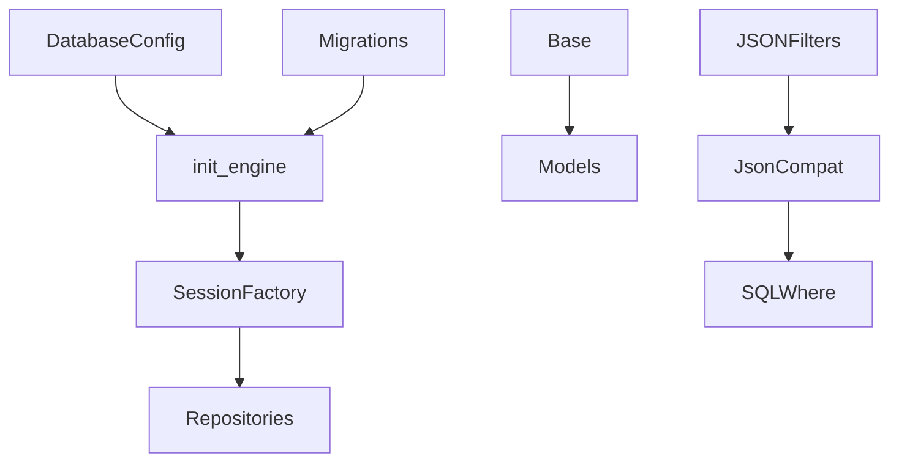

<title>258｜Persistence Engine / Base / JSON Compat 详解</title>

<callout emoji="✅">
**本章目标：**继续拆 persistence/runtime 单文件，说明模型、仓储、provider 的调用关系。
</callout>

| 模块点 | 说明 |
|-|-|
| engine.py | 初始化/关闭 SQLAlchemy engine。 |
| base.py | DeclarativeBase。 |
| json_compat.py | 跨 SQLite/Postgres metadata JSON 查询。 |
| migrations/env.py | Alembic migration env。 |

