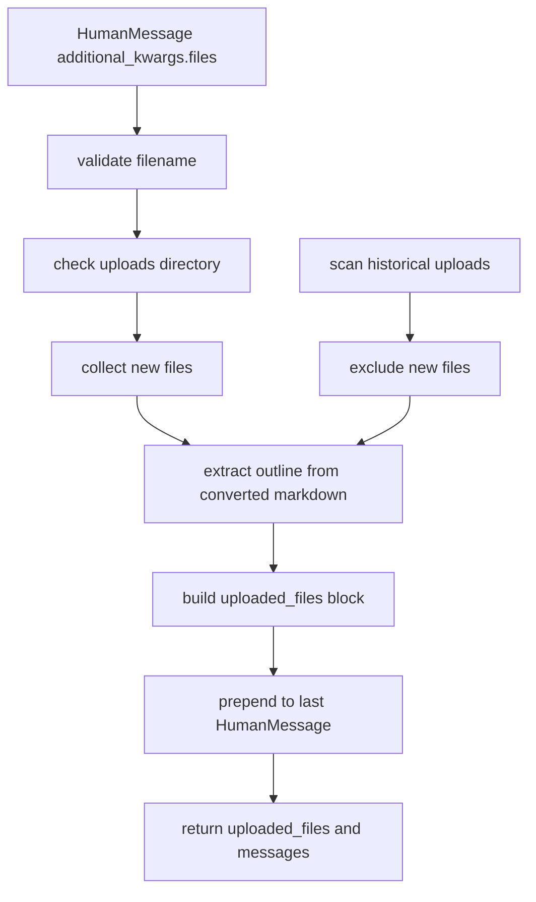
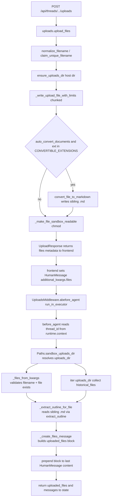

<title>25｜UploadsMiddleware 单文件详解</title>

<callout emoji="✅">
**本章目标：**单独讲清上传文件如何被转换为 agent 可读上下文。
</callout>

| 函数 | 职责 |
|-|-|
| `_files_from_kwargs` | 从 HumanMessage additional_kwargs.files 提取新上传文件。 |
| `_extract_outline_for_file` | 读取转换出的同名 .md，提取标题 outline 或首几行预览。 |
| `_create_files_message` | 生成 `<uploaded_files>` 上下文块。 |
| `before_agent` | 合并新文件和历史文件，替换最后一条 human message。 |

排障重点：如果模型不知道文件，先确认前端 uploadFiles 返回的 files 是否进入 additional_kwargs，再确认 uploads 目录里是否存在真实文件和转换后的 Markdown。

---

# 补充：设计取舍、重点代码与阅读路径

<callout emoji="💡">
**设计目的：**这个模块采用 middleware 形态，是为了把横切能力从主 agent 逻辑里剥离出来，并按 LangChain/LangGraph 生命周期挂载。
</callout>

| 维度 | 说明 |
|-|-|
| 收益 | 收益是可插拔、可独立测试、能按 before/after/wrap 阶段控制行为。 |
| 代价 | 代价是执行顺序不直观，多个 middleware 同时改 messages/state 时调试成本较高。 |
| 重点代码 | 重点代码通常在 `backend/packages/harness/deerflow/agents/middlewares/`，先看 class 的 hook 方法。 |
| 阅读路径 | 阅读路径：先判断它在哪个 hook 生效，再看它读写 ThreadState 的哪些字段。 |

