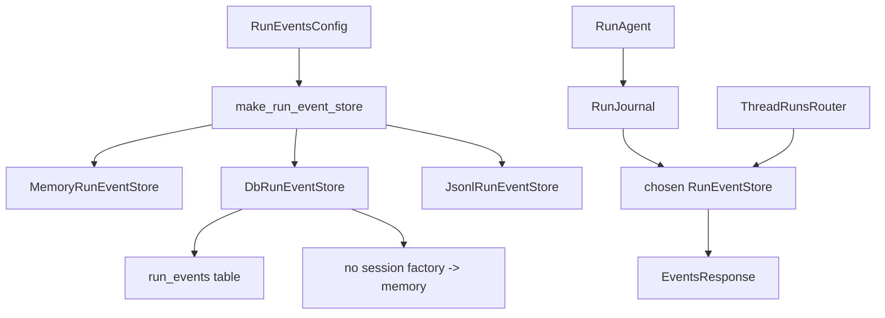

<title>264｜Runtime Events Store Provider 详解</title>

<callout emoji="✅">
**本章目标：**继续拆 persistence/runtime 单文件，说明模型、仓储、provider 的调用关系。
</callout>

| 模块点 | 说明 |
|-|-|
| runtime/events/store/__init__.py | `make_run_event_store(config)` 是事件存储工厂。 |
| RunEventsConfig | 通过 `run_events.backend` 选择 `memory`、`db` 或 `jsonl`。 |
| memory backend | `MemoryRunEventStore` 用于开发/测试，不落 `run_events` 表。 |
| db backend | `DbRunEventStore` 复用 SQLAlchemy session factory，写入 `RunEventRow`，并按 `max_trace_content` 截断 trace。 |
| jsonl backend | `JsonlRunEventStore` 写 JSONL 文件，适合轻量单机持久化。 |
| fallback | `run_events.backend=db` 但 session factory 不存在时，会回退到 `MemoryRunEventStore`。 |
| RunJournal | 写入 human/message/trace/token 等事件，再由 store 分配 thread 内递增 seq。 |
| thread_runs events API | 通过 RunEventStore 读取 messages/events。 |

