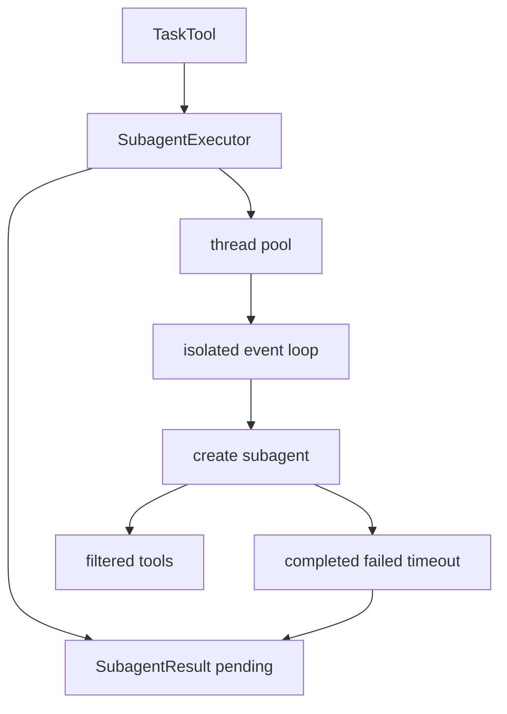

<title>268｜subagents/executor.py 单文件详解</title>

<callout emoji="✅">
**本章目标：**继续拆 runtime、subagents、tools builtins 单文件模块。
</callout>

| 模块点 | 说明 |
|-|-|
| SubagentExecutor | 创建并执行子代理。 |
| ThreadPool/EventLoop | 隔离运行子代理。 |
| SubagentResult | 状态、结果、token usage。 |
| timeout/cancel | 取消和超时。 |
| tool filtering | allowed/disallowed tools。 |

