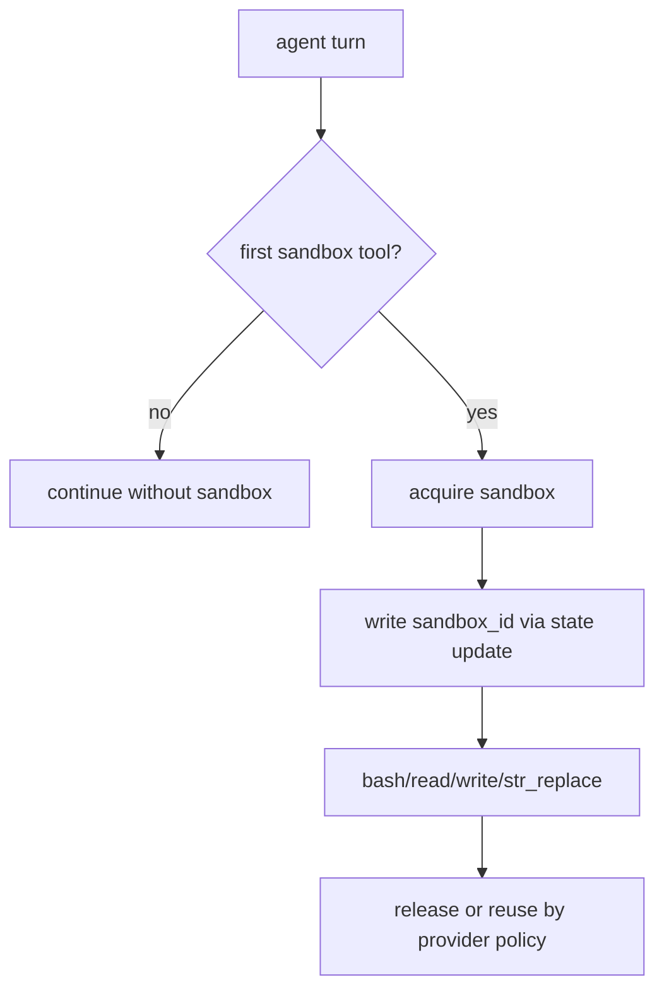
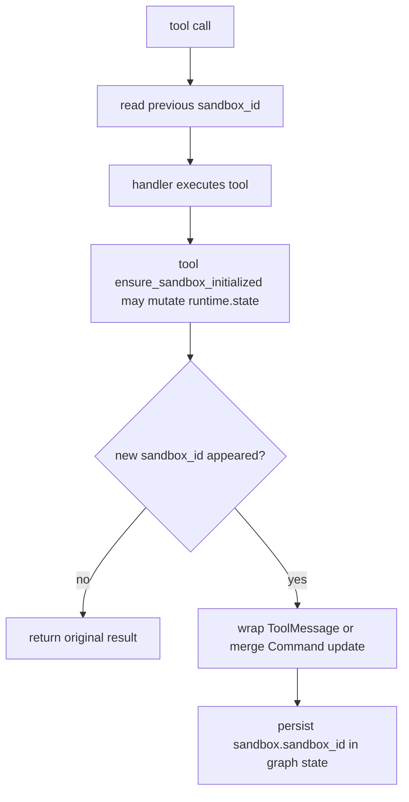
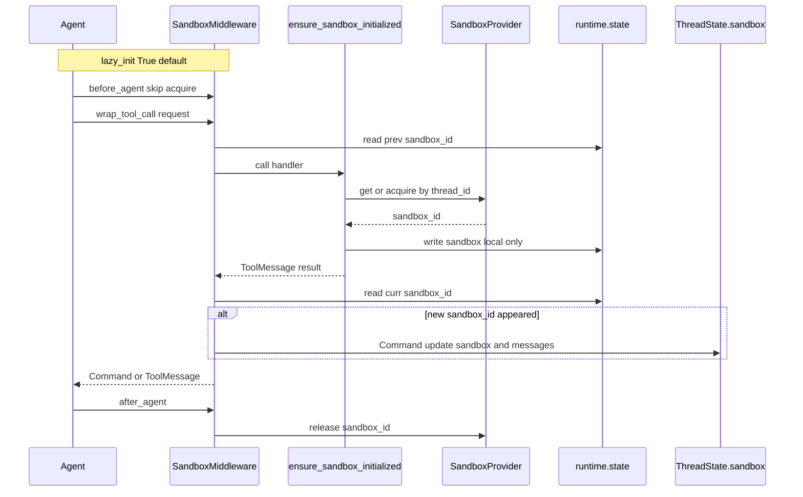

<title>26｜SandboxMiddleware 单文件详解</title>

<callout emoji="✅">
**本章目标：**单独讲清 sandbox 的懒加载、工具调用包裹和 sandbox_id 持久化。
</callout>

## 本轮源码校准补充：SandboxMiddleware

| 关键点 | 说明 |
|-|-|
| lazy acquisition | sandbox 默认在第一次工具调用时获取，不是每个 turn 一开始就创建。 |
| state persistence | sandbox id 会写回 graph state，后续工具可以复用上下文。 |
| provider 差异 | LocalSandbox 和 AioSandbox/容器 provider 的隔离程度、bash 能力和清理策略不同。 |

| Hook | 职责 |
|-|-|
| `before_agent/abefore_agent` | 非 lazy 模式提前 acquire sandbox。 |
| `wrap_tool_call/awrap_tool_call` | 工具调用前后检查 runtime.state.sandbox，新增时返回 Command(update)。 |
| `after_agent/aafter_agent` | 释放 sandbox。 |

关键点：直接修改 runtime.state 不会自动进入 LangGraph reducer，所以 middleware 必须把新 sandbox_id 包进 Command(update)。

---

# 补充：设计取舍、重点代码与阅读路径

<callout emoji="💡">
**设计目的：**这个模块采用 middleware 形态，是为了把横切能力从主 agent 逻辑里剥离出来，并按 LangChain/LangGraph 生命周期挂载。
</callout>

| 维度 | 说明 |
|-|-|
| 收益 | 收益是可插拔、可独立测试、能按 before/after/wrap 阶段控制行为。 |
| 代价 | 代价是执行顺序不直观，多个 middleware 同时改 messages/state 时调试成本较高。 |
| 重点代码 | 重点代码通常在 `backend/packages/harness/deerflow/agents/middlewares/`，先看 class 的 hook 方法。 |
| 阅读路径 | 阅读路径：先判断它在哪个 hook 生效，再看它读写 ThreadState 的哪些字段。 |

