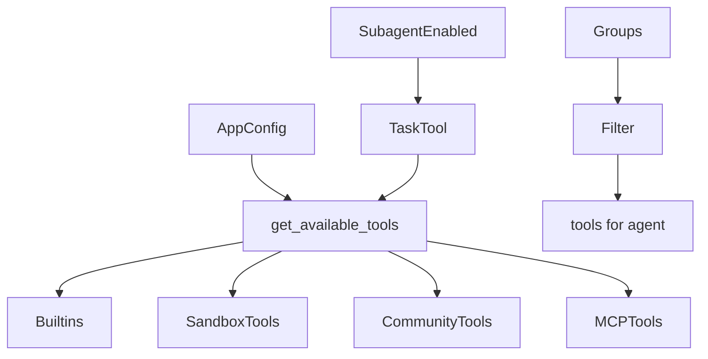

<title>272｜tools/tools.py 单文件详解</title>

<callout emoji="✅">
**本章目标：**继续拆 tools/reflection/utils 等基础模块。
</callout>

| 模块点 | 说明 |
|-|-|
| get_available_tools | 聚合内置、sandbox、community、MCP 工具。 |
| groups | 按工具组过滤。 |
| subagent_enabled | 决定是否加入 task tool。 |
| app_config | 从 AppConfig 读取工具配置。 |

---

# 补充：设计取舍、重点代码与阅读路径

<callout emoji="💡">
**设计目的：**该文档说明工程脚本、测试、部署或运行时辅助模块的职责、调用入口和验证方式，避免把流程知识只留在脚本里。
</callout>

| 维度 | 说明 |
|-|-|
| 收益 | 新同学能按脚本/测试入口复现工程流程，并知道失败时应检查哪个阶段。 |
| 代价 | 脚本和 CI 逻辑容易随依赖或平台变化漂移，需要用命令和源码双重验证。 |
| 重点代码 | 文档标题对应的 `scripts/`、`docker/`、`backend/tests/`、`frontend/tests/` 或 `docs/` 文件。 |
| 阅读路径 | 先看入口命令，再看脚本调用链，最后看测试或日志如何证明行为。 |

```mermaid
flowchart TD
  Start["get_available_tools groups, subagent_enabled, app_config"] --> Resolve["get_app_config / AppConfig"]
  Resolve --> Filter["filter config.tools by groups"]
  Filter --> Bash{"is_host_bash_allowed?"}
  Bash -- "False" --> Strip["drop host-bash via _is_host_bash_tool"]
  Bash -- "True" --> Load["resolve_variable cfg.use to BaseTool"]
  Strip --> Load
  Load --> Warn["warn cfg.name vs tool.name mismatch"]
  Warn --> Sync1["_ensure_sync_invocable_tool"]
  Sync1 --> Builtin["BUILTIN_TOOLS"]
  Builtin --> Skill{"skill_evolution.enabled?"}
  Skill -- "True" --> AddSkill["skill_manage_tool"]
  Skill -- "False" --> Sub{"subagent_enabled?"}
  AddSkill --> Sub
  Sub -- "True" --> AddTask["SUBAGENT_TOOLS = task_tool"]
  Sub -- "False" --> Vision{"model.supports_vision?"}
  AddTask --> Vision
  Vision -- "True" --> AddView["view_image_tool"]
  Vision -- "False" --> MCP{"include_mcp?"}
  AddView --> MCP
  MCP -- "True" --> Cached["get_cached_mcp_tools + tag_mcp_tool"]
  MCP -- "False" --> ACP{"acp_agents?"}
  Cached --> ACP
  ACP -- "True" --> AddACP["build_invoke_acp_agent_tool"]
  ACP -- "False" --> Dedup
  AddACP --> Dedup["dedup by t.name, config wins"]
  Dedup --> Return["return unique_tools"]
```

