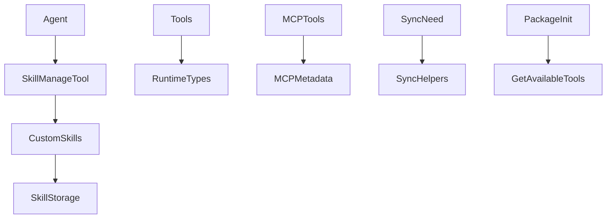

<title>273｜skill_manage_tool / sync / mcp_metadata / types 详解</title>

<callout emoji="✅">
**本章目标：**继续拆 tools/reflection/utils 等基础模块。
</callout>

| 模块点 | 说明 |
|-|-|
| skill_manage_tool.py | agent 创建/编辑 custom skill。 |
| sync.py | 同步类工具辅助。 |
| mcp_metadata.py | MCP metadata 辅助。 |
| types.py | 工具 runtime/type 定义。 |
| \_\_init\_\_.py | tools 包导出。 |

