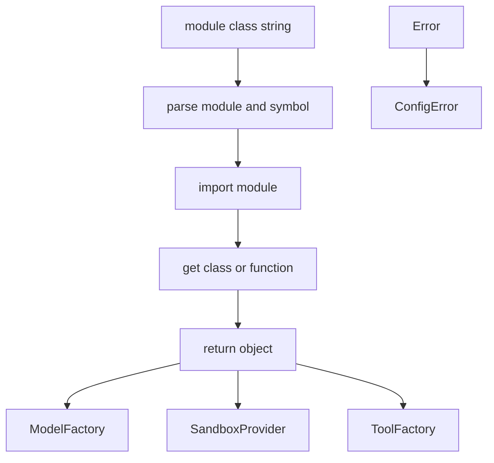

<title>274｜reflection/resolvers.py 单文件详解</title>

<callout emoji="✅">
**本章目标：**继续拆 tools/reflection/utils 等基础模块。
</callout>

| 模块点 | 说明 |
|-|-|
| resolve_class | 按 module:Class 字符串解析类。 |
| dynamic imports | 动态导入 provider/tool 类。 |
| 配置驱动 | ModelConfig.use 等字段依赖 resolver。 |
| 错误处理 | 解析失败时提示配置问题。 |

