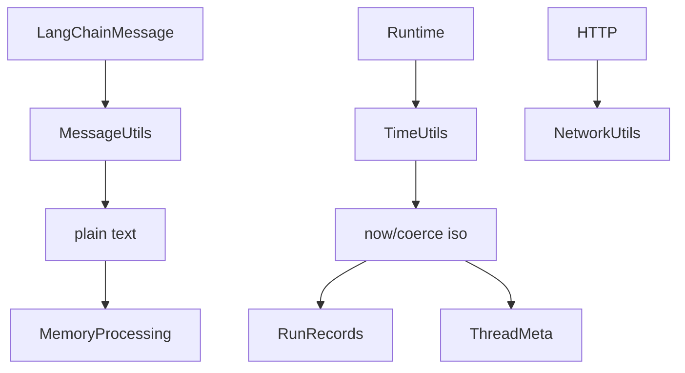

<title>276｜utils/messages、network、time 详解</title>

<callout emoji="✅">
**本章目标：**继续拆 tools/reflection/utils 等基础模块。
</callout>

| 模块点 | 说明 |
|-|-|
| messages.py | message content 转文本、原始用户内容 key。 |
| network.py | 网络相关辅助。 |
| time.py | now_iso、timezone、coerce_iso。 |
| 使用方 | uploads/memory/runtime/thread meta 等。 |

