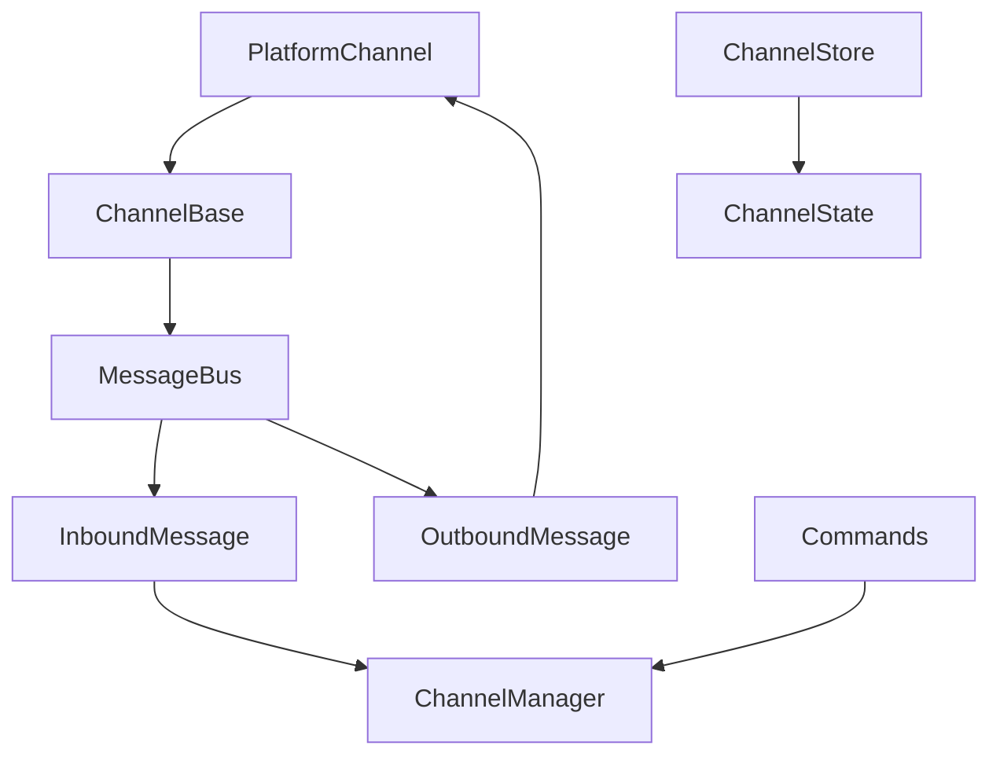

<title>279｜Channel Base / MessageBus / Store 单文件详解</title>

<callout emoji="✅">
**本章目标：**继续拆 channels/auth/frontend core 单文件模块。
</callout>

| 模块点 | 说明 |
|-|-|
| base.py | Channel 抽象基类。 |
| message_bus.py | InboundMessage/OutboundMessage/MessageBus。 |
| store.py | ChannelStore。 |
| commands.py | 已知 channel 命令识别。 |

