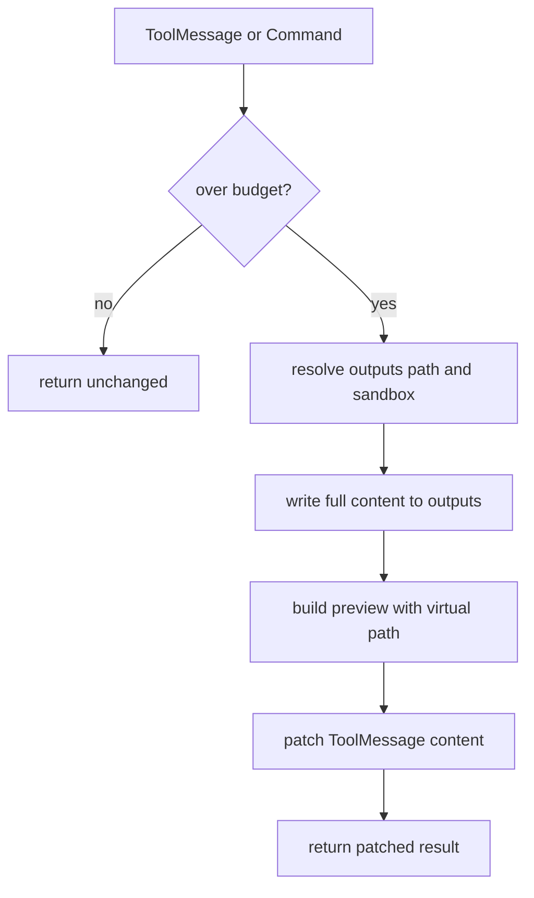
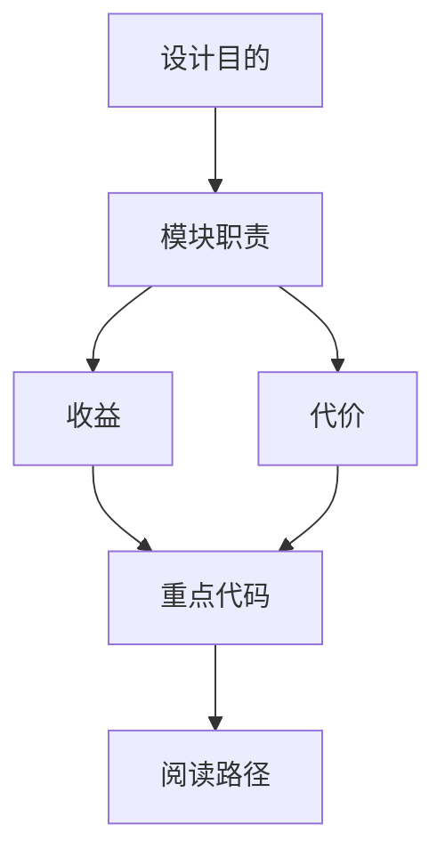

<title>27｜ToolOutputBudgetMiddleware 单文件详解</title>

<callout emoji="✅">
**本章目标：**单独讲清大工具输出如何外置到 outputs，避免模型上下文被单次工具返回撑爆。
</callout>

| 阶段 | 逻辑 |
|-|-|
| 检测 | 读取 ToolMessage 文本长度，对比全局/工具级阈值。 |
| 外置 | 优先写入 sandbox outputs，否则写物理 outputs_path。 |
| 预览 | 构造首尾摘要和 virtual path。 |
| 回写 | 替换 ToolMessage content；Command 结果则 patch update.messages。 |

排障重点：如果工具结果只有预览，去提示里的 `/mnt/user-data/outputs/...` 读取完整文件。

---

# 补充：设计取舍、重点代码与阅读路径

<callout emoji="💡">
**设计目的：**这个模块采用 middleware 形态，是为了把横切能力从主 agent 逻辑里剥离出来，并按 LangChain/LangGraph 生命周期挂载。
</callout>

| 维度 | 说明 |
|-|-|
| 收益 | 收益是可插拔、可独立测试、能按 before/after/wrap 阶段控制行为。 |
| 代价 | 代价是执行顺序不直观，多个 middleware 同时改 messages/state 时调试成本较高。 |
| 重点代码 | 重点代码通常在 `backend/packages/harness/deerflow/agents/middlewares/`，先看 class 的 hook 方法。 |
| 阅读路径 | 阅读路径：先判断它在哪个 hook 生效，再看它读写 ThreadState 的哪些字段。 |

