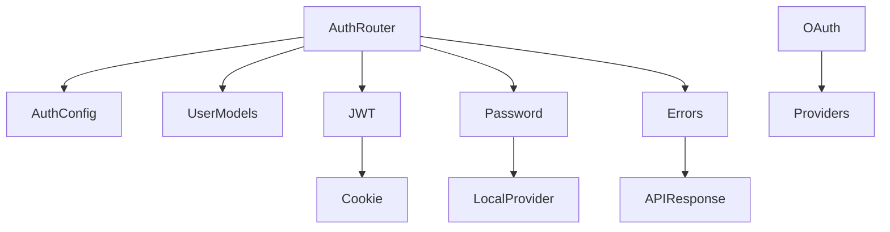
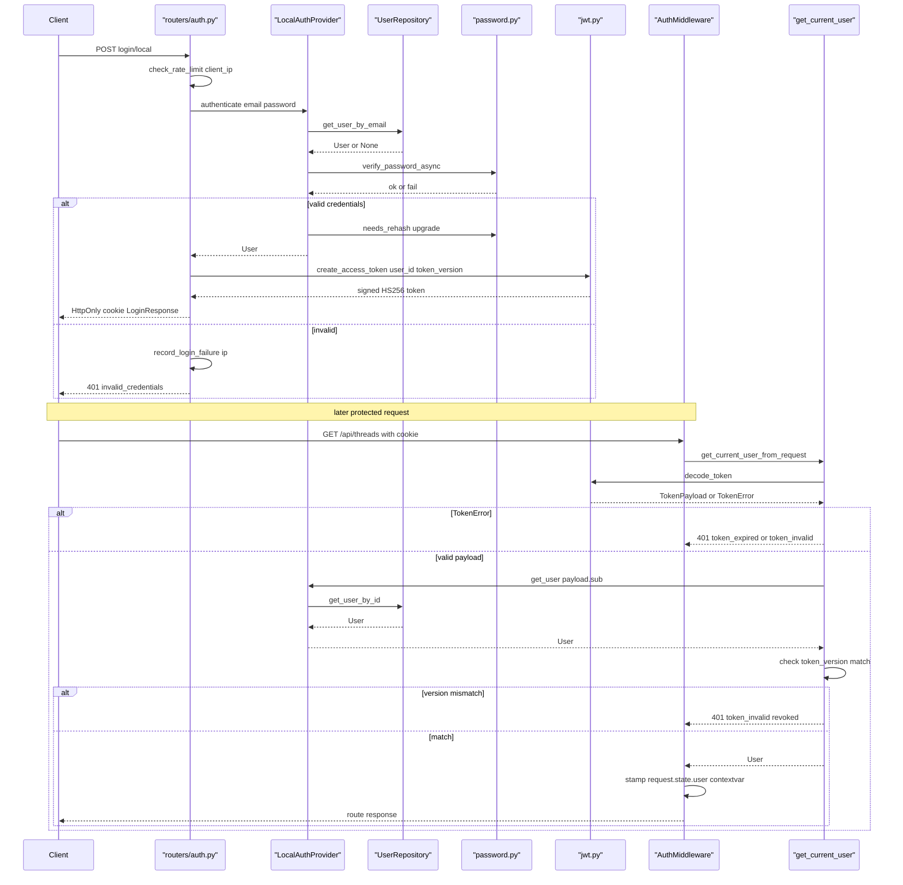

<title>281｜Gateway Auth 子模块详解</title>

<callout emoji="✅">
**本章目标：**继续拆 channels/auth/frontend core 单文件模块。
</callout>

| 模块点 | 说明 |
|-|-|
| auth/config.py | auth 配置。 |
| auth/models.py | UserResponse 等模型。 |
| auth/jwt.py | JWT/session token。 |
| auth/password.py | 密码 hash。 |
| auth/errors.py | 错误码。 |
| auth/providers.py | OAuth provider 抽象。 |

---

# 补充：设计取舍、重点代码与阅读路径

<callout emoji="💡">
**设计目的：**这个模块以 API/边界层拆分，是为了隔离 HTTP 协议、认证鉴权、请求模型和内部业务。
</callout>

| 维度 | 说明 |
|-|-|
| 收益 | 收益是前后端契约清晰，接口可独立演进。 |
| 代价 | 代价是一次功能可能跨 router、service、repository 和前端 hook。 |
| 重点代码 | 重点代码在 `backend/app/gateway/routers/`、`backend/app/gateway/auth/*` 或对应前端 `frontend/src/core/*/api.ts`。 |
| 阅读路径 | 阅读路径：从 URL/API 入口往内追 service，再看数据落到哪里。 |

