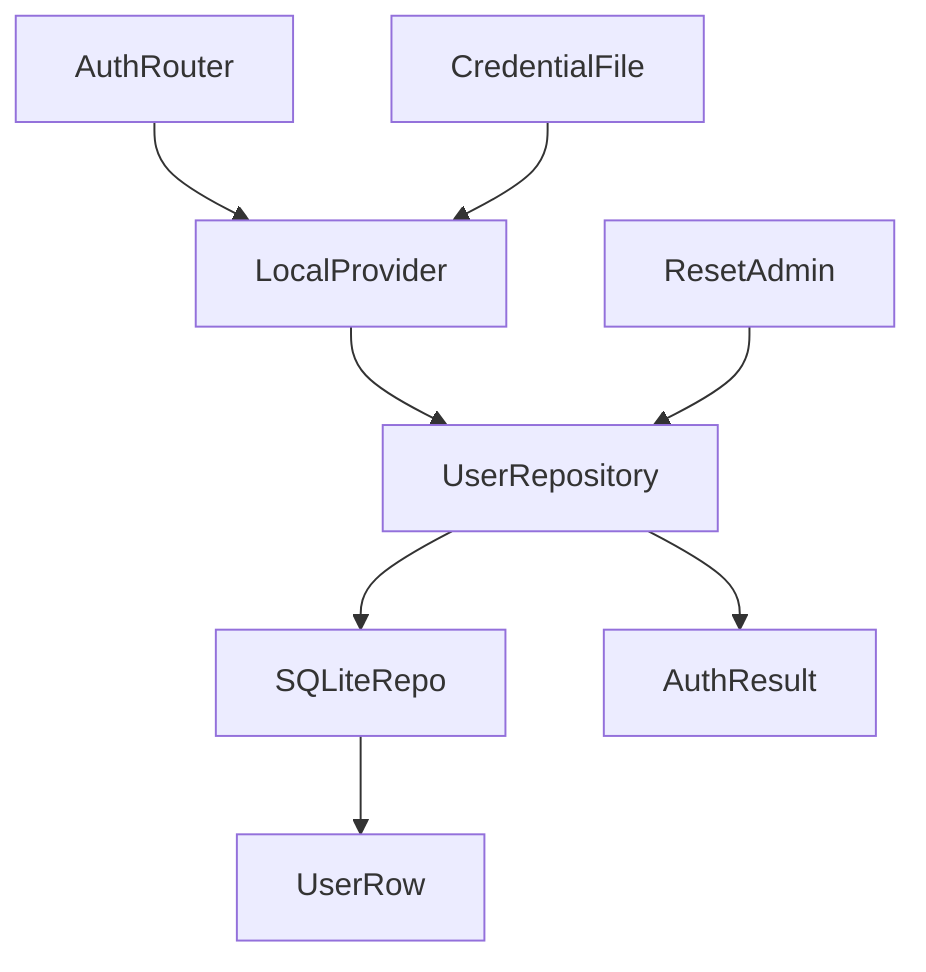
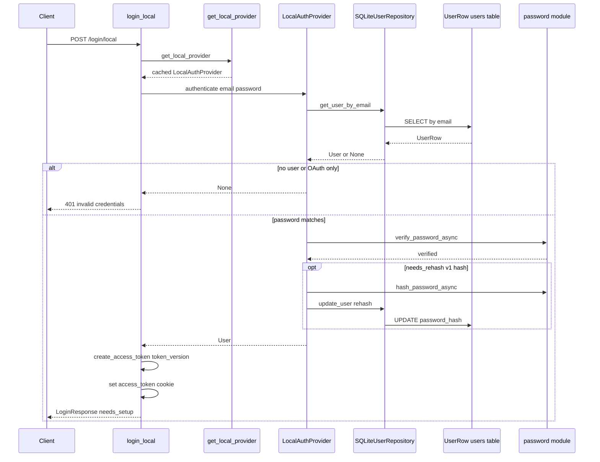

<title>282｜Gateway LocalAuthProvider / SQLiteUserRepository 详解</title>

<callout emoji="✅">
**本章目标：**继续拆 channels/auth/frontend core 单文件模块。
</callout>

| 模块点 | 说明 |
|-|-|
| local_provider.py | 本地认证 provider。 |
| repositories/sqlite.py | SQLite user repo。 |
| repositories/base.py | repo 抽象。 |
| credential_file.py | 凭证文件。 |
| reset_admin.py | 重置 admin。 |

---

# 补充：设计取舍、重点代码与阅读路径

<callout emoji="💡">
**设计目的：**这个模块以 API/边界层拆分，是为了隔离 HTTP 协议、认证鉴权、请求模型和内部业务。
</callout>

| 维度 | 说明 |
|-|-|
| 收益 | 收益是前后端契约清晰，接口可独立演进。 |
| 代价 | 代价是一次功能可能跨 router、service、repository 和前端 hook。 |
| 重点代码 | 重点代码在 `backend/app/gateway/routers/`、`backend/app/gateway/auth/*` 或对应前端 `frontend/src/core/*/api.ts`。 |
| 阅读路径 | 阅读路径：从 URL/API 入口往内追 service，再看数据落到哪里。 |

