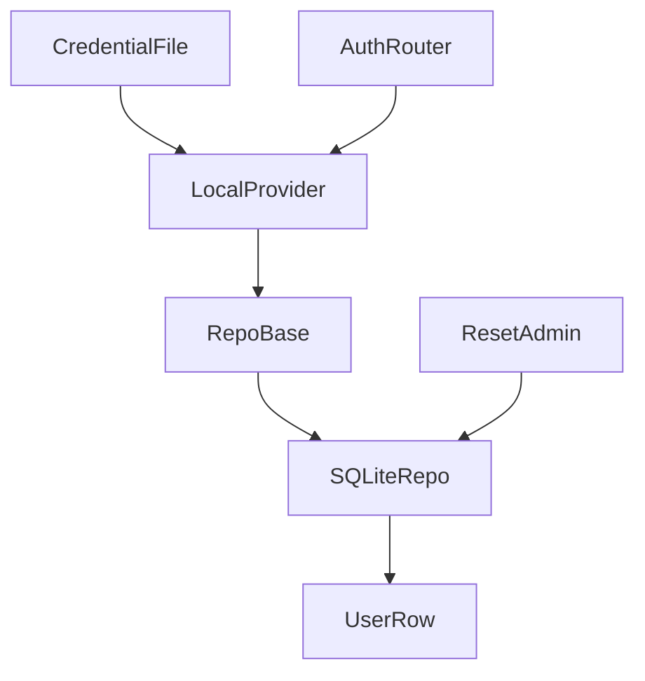

<title>288｜auth repository、credential_file、reset_admin 详解</title>

<callout emoji="✅">
**本章目标：**继续拆 auth/channel/frontend core 单文件模块。
</callout>

| 模块点 | 说明 |
|-|-|
| repositories/base.py | 用户 repo 抽象。 |
| repositories/sqlite.py | SQLite user repo。 |
| credential_file.py | 凭证文件读取。 |
| reset_admin.py | 重置 admin 工具。 |
| local_provider.py | 组合 repo 和认证逻辑。 |

