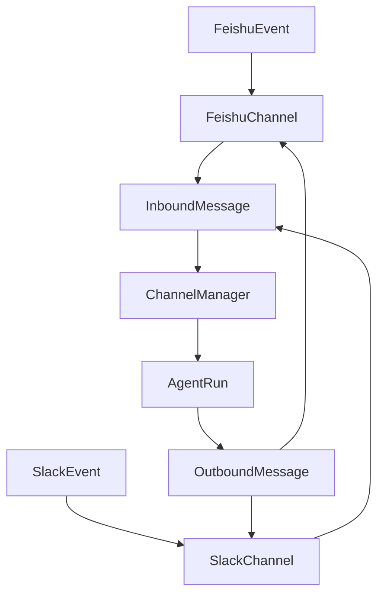

<title>289｜Feishu 与 Slack Channel 单文件详解</title>

<callout emoji="✅">
**本章目标：**继续拆 auth/channel/frontend core 单文件模块。
</callout>

| 模块点 | 说明 |
|-|-|
| feishu.py | 飞书事件、卡片更新、命令识别。 |
| slack.py | Slack Socket Mode、mention 剥离、allowed users。 |
| manager.py | 两者都转入 ChannelManager。 |
| message_bus.py | 统一消息结构。 |

