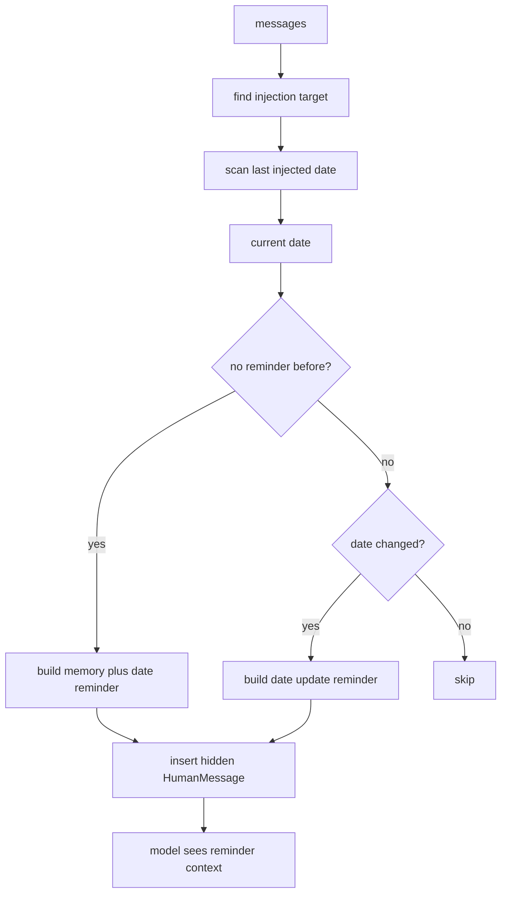
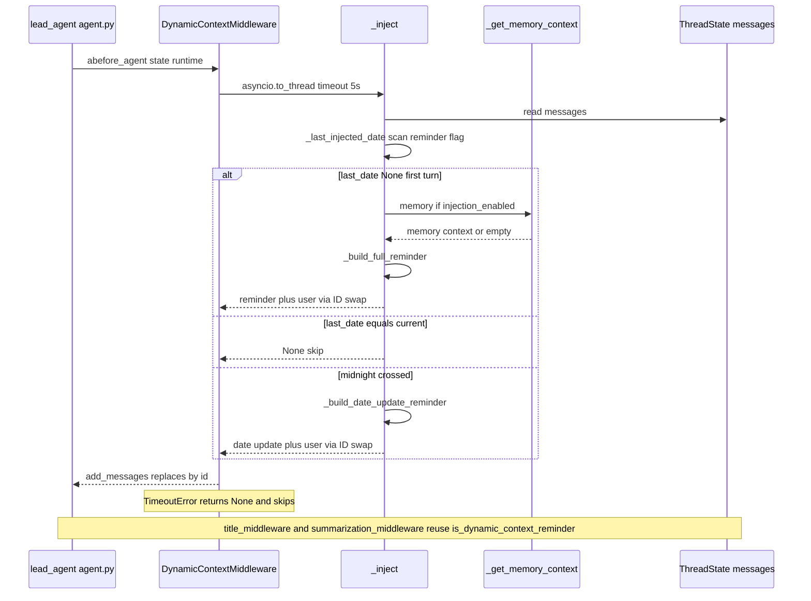

<title>28｜DynamicContextMiddleware 单文件详解</title>

<callout emoji="✅">
**本章目标：**单独讲清当前日期和 memory 如何以隐藏 HumanMessage 形式注入，同时保持 system prompt 静态。
</callout>

| 设计 | 说明 |
|-|-|
| 静态 system prompt | 为了 prefix cache，日期和 memory 不放 system prompt。 |
| 首次注入 | 在第一条用户消息前插入 full system-reminder。 |
| 跨天修正 | 检测已注入日期，如跨天则给当前 turn 插入 date update。 |
| ID swap | reminder 复用原 user message id，原用户内容派生新 id。 |

---

# 补充：设计取舍、重点代码与阅读路径

<callout emoji="💡">
**设计目的：**这个模块采用 middleware 形态，是为了把横切能力从主 agent 逻辑里剥离出来，并按 LangChain/LangGraph 生命周期挂载。
</callout>

| 维度 | 说明 |
|-|-|
| 收益 | 收益是可插拔、可独立测试、能按 before/after/wrap 阶段控制行为。 |
| 代价 | 代价是执行顺序不直观，多个 middleware 同时改 messages/state 时调试成本较高。 |
| 重点代码 | 重点代码通常在 `backend/packages/harness/deerflow/agents/middlewares/`，先看 class 的 hook 方法。 |
| 阅读路径 | 阅读路径：先判断它在哪个 hook 生效，再看它读写 ThreadState 的哪些字段。 |

