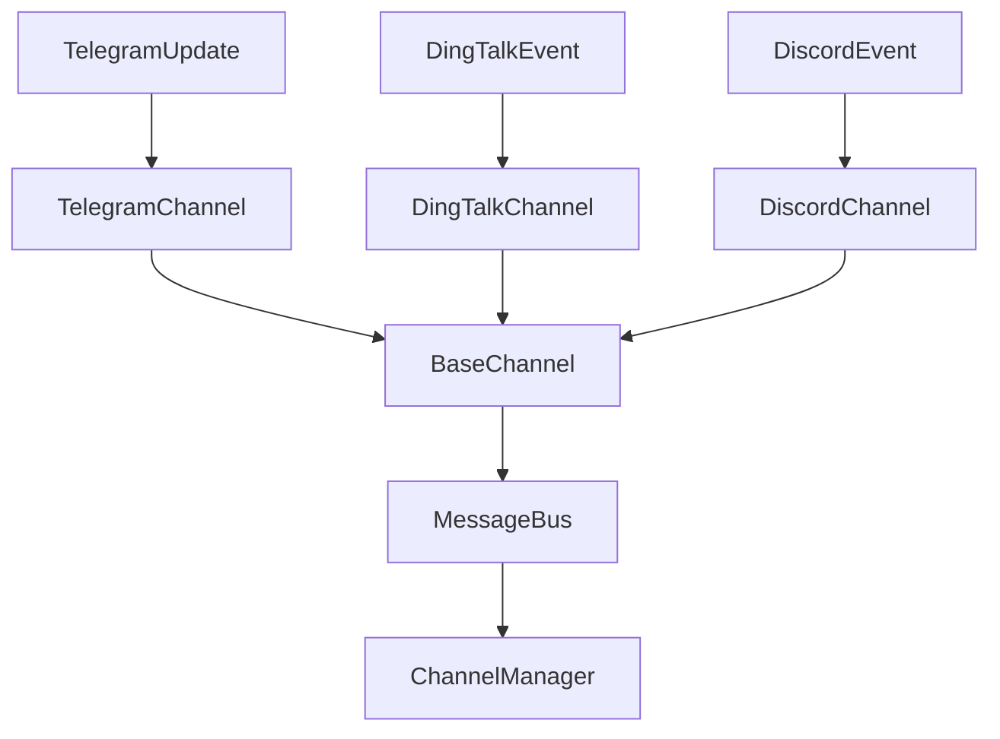
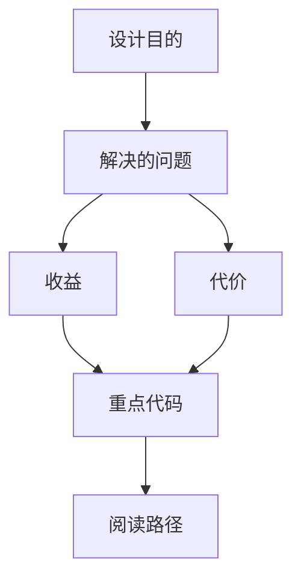

<title>290｜Telegram、DingTalk、Discord Channel 单文件详解</title>

<callout emoji="✅">
**本章目标：**继续拆 auth/channel/frontend core 单文件模块。
</callout>

| 模块点 | 说明 |
|-|-|
| telegram.py | Telegram Bot API。 |
| dingtalk.py | DingTalk Stream Push、Markdown 适配。 |
| discord.py | Discord channel。 |
| base.py | Channel 抽象。 |

---

# 补充：设计取舍、重点代码与阅读路径

<callout emoji="💡">
**设计目的：**这些 channel adapter 把不同 IM 平台的事件协议收敛成统一 `InboundMessage`，再通过 `MessageBus` 交给 `ChannelManager`。
</callout>

| 维度 | 说明 |
|-|-|
| 收益 | 平台差异被限制在 adapter 内，运行层只处理统一消息和附件结构。 |
| 代价 | 每个平台的鉴权、长连接、thread/topic、文件上传能力不同，adapter 需要分别处理。 |
| 重点代码 | `backend/app/channels/telegram.py`、`dingtalk.py`、`discord.py`、`base.py`、`message_bus.py`、`manager.py`。 |
| 阅读路径 | 先看 channel 如何产生 InboundMessage，再看 ChannelManager 如何启动 run，最后看 OutboundMessage 如何回到平台。 |

