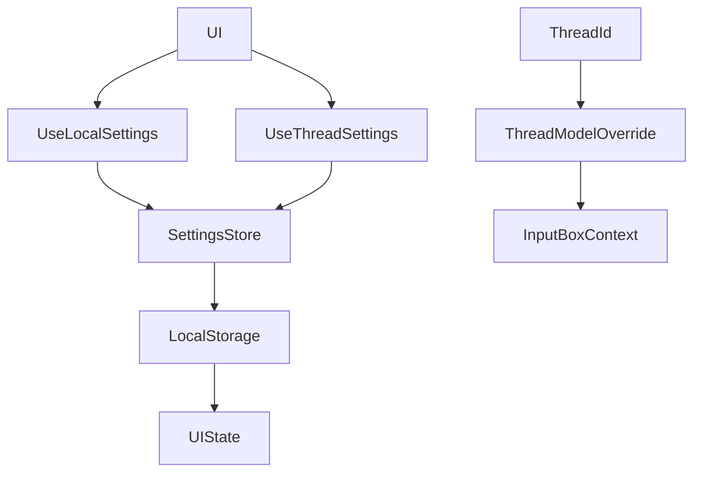
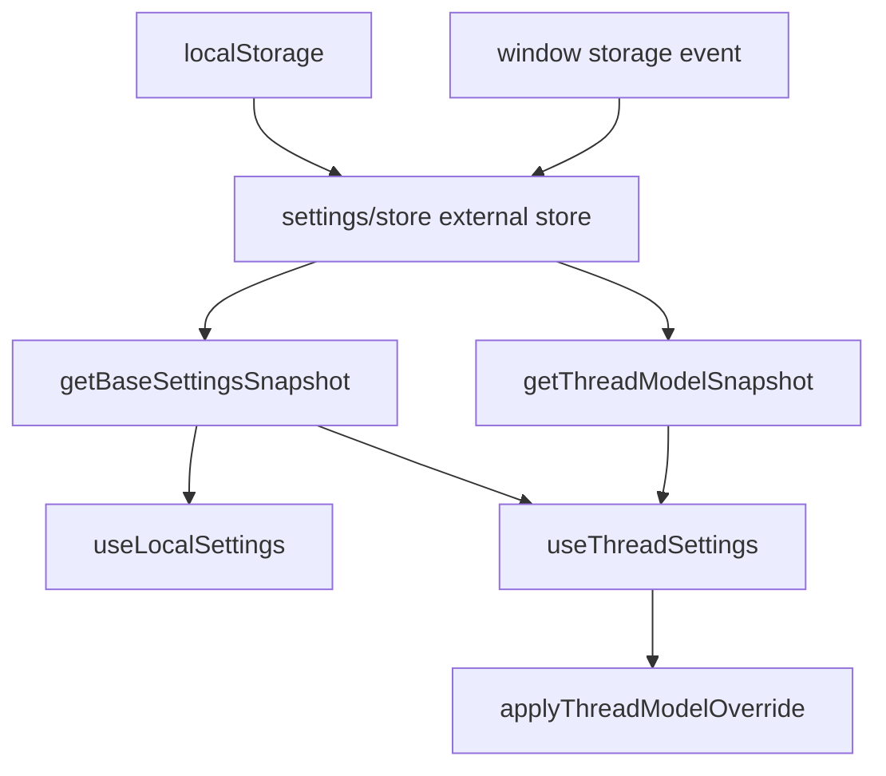

<title>297｜Frontend Core Settings 文件详解</title>

<callout emoji="✅">
**本章目标：**继续拆 frontend core 数据层单文件模块。
</callout>

| 模块点 | 说明 |
|-|-|
| settings/local.ts | 默认设置和 local 类型。 |
| settings/store.ts | localStorage 读写。 |
| settings/hooks.ts | useLocalSettings/useThreadSettings。 |
| settings/index.ts | 统一导出。 |

---

# 补充：设计取舍、重点代码与阅读路径

<callout emoji="💡">
**设计目的：**frontend settings 用 `useSyncExternalStore` 包装 localStorage，让通知、token usage、默认上下文和每个 thread 的 model override 在组件间稳定共享。
</callout>

| 维度 | 说明 |
|-|-|
| 收益 | UI 读写设置不需要 React Query 或后端请求，并且同一浏览器多标签页可通过 storage event 同步。 |
| 代价 | SSR 环境必须返回默认值，且 thread model override 需要单独维护 `deerflow.thread-model.{threadId}`。 |
| 重点代码 | `frontend/src/core/settings/local.ts`、`frontend/src/core/settings/store.ts`、`frontend/src/core/settings/hooks.ts`。 |
| 阅读路径 | 先看 localStorage key 和默认值，再看 store 的 listener/snapshot，最后看 `useLocalSettings` 与 `useThreadSettings` 如何把 base settings 合并 thread override。 |

