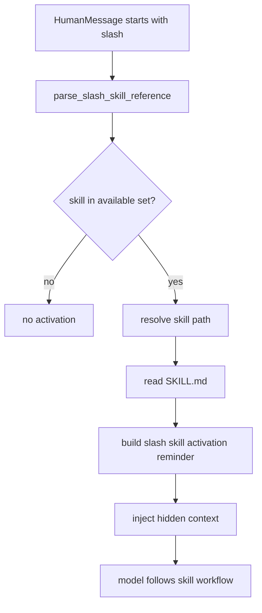
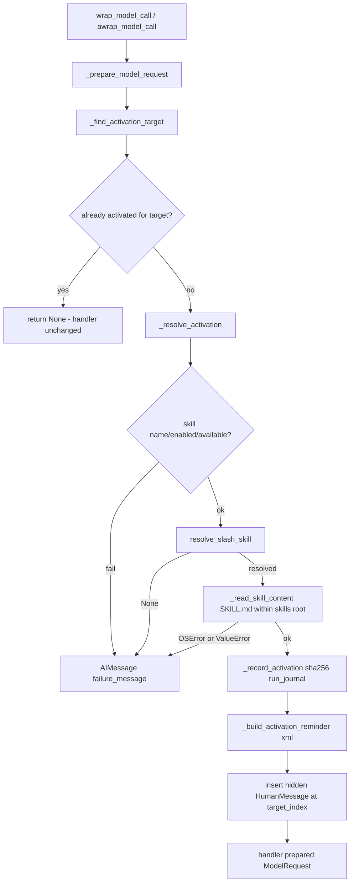

<title>29｜SkillActivationMiddleware 单文件详解</title>

<callout emoji="✅">
**本章目标：**单独讲清 /skill-name 显式激活如何解析、定位、读取并注入完整 SKILL.md。
</callout>

## 本轮源码校准补充：SkillActivationMiddleware

| 行为 | 说明 |
|-|-|
| 激活方式 | 严格匹配 `/skill-name task` 形式的最新真实用户消息。 |
| 内容来源 | 从可信 skill storage 读取 `SKILL.md`，作为 hidden/current-turn model context 注入。 |
| 工具限制 | 如果被激活 skill 声明 `allowed-tools`，会参与工具过滤策略。 |
| 审计 | 记录 skill name、category、path、content hash 等 audit 信息。 |

| 步骤 | 说明 |
|-|-|
| 解析 | 识别最后一条用户消息开头的 slash skill。 |
| 解析路径 | 根据 available_skills 和 skill storage 定位 SKILL.md。 |
| 读取 | 读取完整技能说明和必要元数据。 |
| 注入 | 添加隐藏 reminder，让模型本轮遵循该 skill。 |

---

# 补充：设计取舍、重点代码与阅读路径

<callout emoji="💡">
**设计目的：**这个模块采用 middleware 形态，是为了把横切能力从主 agent 逻辑里剥离出来，并按 LangChain/LangGraph 生命周期挂载。
</callout>

| 维度 | 说明 |
|-|-|
| 收益 | 收益是可插拔、可独立测试、能按 before/after/wrap 阶段控制行为。 |
| 代价 | 代价是执行顺序不直观，多个 middleware 同时改 messages/state 时调试成本较高。 |
| 重点代码 | 重点代码通常在 `backend/packages/harness/deerflow/agents/middlewares/`，先看 class 的 hook 方法。 |
| 阅读路径 | 阅读路径：先判断它在哪个 hook 生效，再看它读写 ThreadState 的哪些字段。 |

