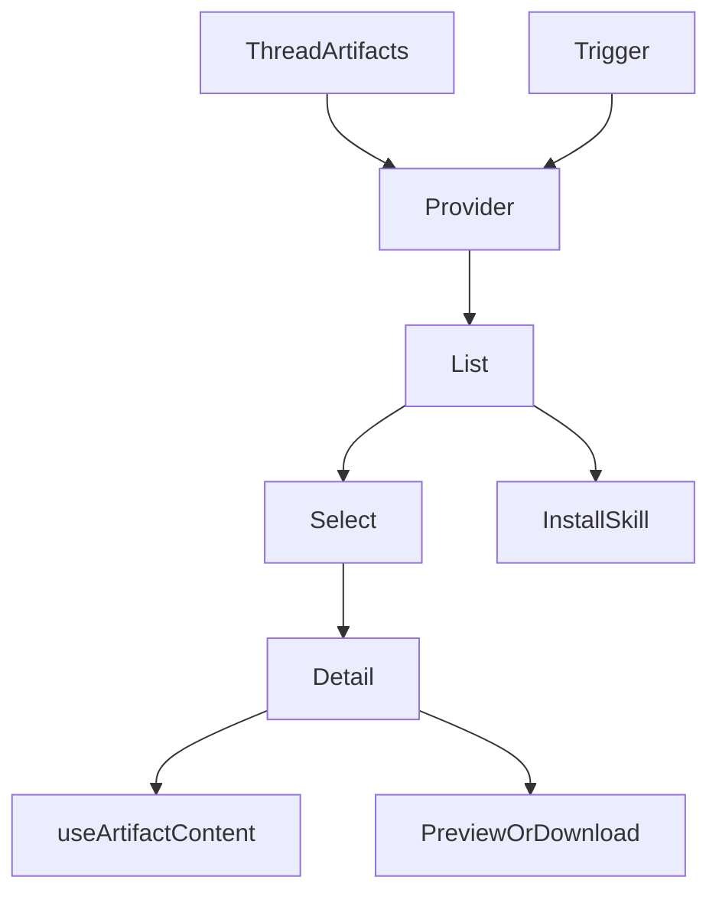
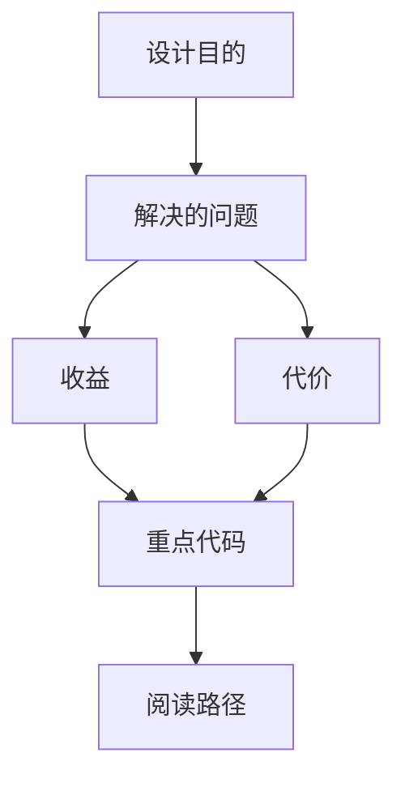
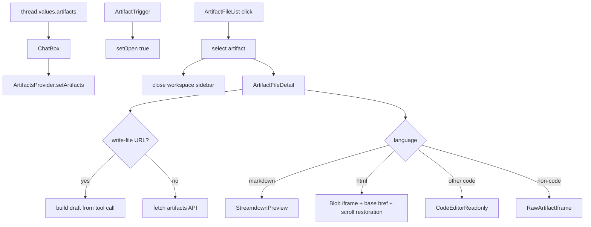

<title>302｜Artifact File List / Detail / Trigger 单文件详解</title>

<callout emoji="✅">
**本章目标：**继续拆 frontend workspace/chat/artifacts/messages 单文件模块。
</callout>

| 模块点 | 说明 |
|-|-|
| artifact-file-list.tsx | artifact 列表、选择、下载、安装 skill。 |
| artifact-file-detail.tsx | artifact 内容预览。 |
| artifact-trigger.tsx | 打开面板按钮。 |
| context.tsx | ArtifactsProvider 状态。 |

---

# 补充：设计取舍、重点代码与阅读路径

<callout emoji="💡">
**设计目的：**Artifact File List / Detail / Trigger 把 `thread.values.artifacts` 转成可选择、预览、下载、安装 skill 的右侧面板交互。
</callout>

| 维度 | 说明 |
|-|-|
| 收益 | 收益是展示层和数据请求分离，组件更容易复用。 |
| 代价 | 代价是一次用户交互常跨页面、hook、缓存、上下文和组件。 |
| 重点代码 | 重点代码在 `frontend/src/app`、`frontend/src/core`、`frontend/src/components` 对应模块。 |
| 阅读路径 | 阅读路径：先找 route，再找 hook 数据源，最后看组件消费。 |

## Artifact 面板与预览状态补充

Artifact 面板不是单纯的文件列表。`ArtifactsProvider` 保存 `artifacts`、`selectedArtifact`、`open`、`autoOpen`、`autoSelect`；`ChatBox` 每次从 `thread.values.artifacts` 同步列表，thread 切换时会 `deselect()`，并根据打开状态把左右 panel 从 100/0 调整为 60/40。

