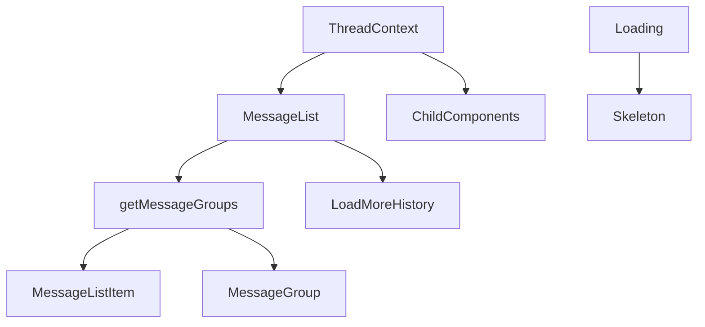
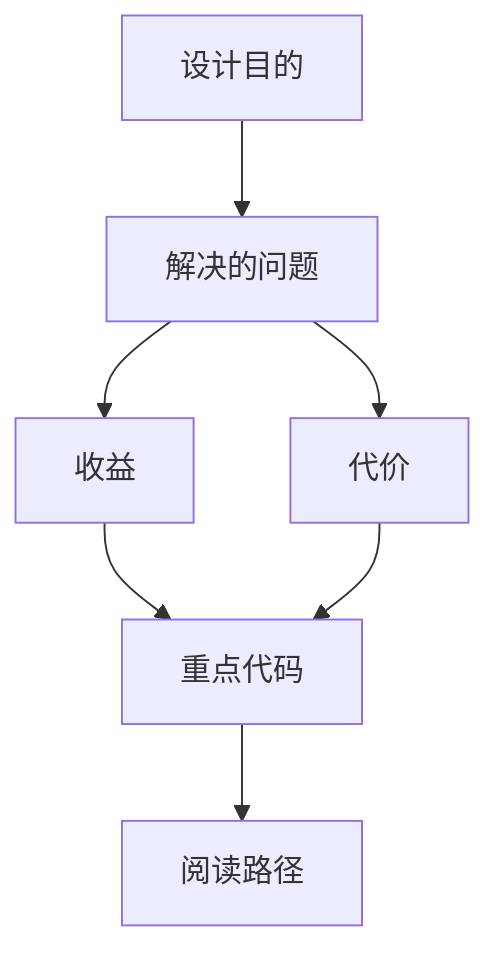
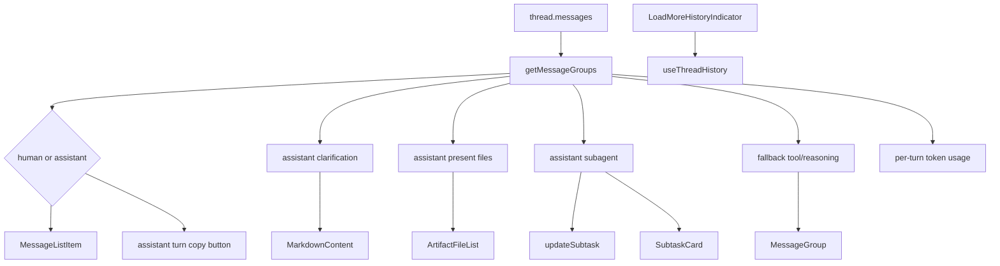

<title>303｜MessageList 组件族细节详解</title>

<callout emoji="✅">
**本章目标：**继续拆 frontend workspace/chat/artifacts/messages 单文件模块。
</callout>

| 模块点 | 说明 |
|-|-|
| message-list.tsx | 列表、历史加载、分组。 |
| message-list-item.tsx | 单消息渲染。 |
| message-group.tsx | processing group。 |
| skeleton.tsx | 加载骨架。 |
| context.ts | ThreadContext。 |

---

# 补充：设计取舍、重点代码与阅读路径

<callout emoji="💡">
**设计目的：**MessageList 组件族把 LangGraph message 列表按类型路由到 markdown、artifact、subtask、tool/reasoning、token usage 和历史加载等不同展示分支。
</callout>

| 维度 | 说明 |
|-|-|
| 收益 | 收益是展示层和数据请求分离，组件更容易复用。 |
| 代价 | 代价是一次用户交互常跨页面、hook、缓存、上下文和组件。 |
| 重点代码 | 重点代码在 `frontend/src/app`、`frontend/src/core`、`frontend/src/components` 对应模块。 |
| 阅读路径 | 阅读路径：先找 route，再找 hook 数据源，最后看组件消费。 |

## MessageList 分组渲染状态补充

`MessageList` 的核心不是只把消息逐条渲染出来，而是先用 `getMessageGroups` 把消息分成不同 UI 分支，再分别接入 markdown、artifact、subtask、tool/reasoning、token usage 与历史加载。

