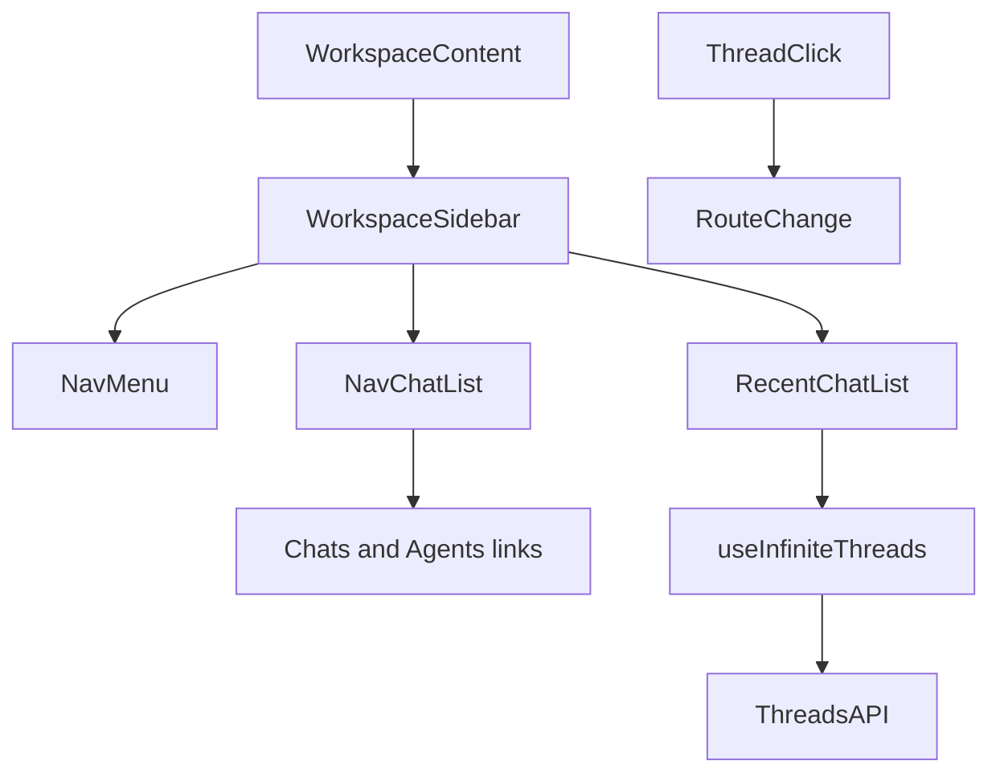
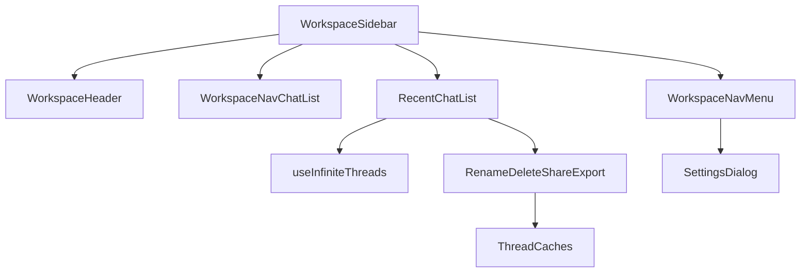

<title>305｜WorkspaceSidebar、NavChatList、RecentChatList 详解</title>

<callout emoji="✅">
**本章目标：**继续拆 frontend workspace/chat/artifacts/messages 单文件模块。
</callout>

| 模块点 | 说明 |
|-|-|
| workspace-sidebar.tsx | 侧边栏总装。 |
| workspace-nav-chat-list.tsx | 会话导航列表。 |
| recent-chat-list.tsx | 最近会话。 |
| workspace-nav-menu.tsx | 导航菜单。 |

---

# 补充：设计取舍、重点代码与阅读路径

<callout emoji="💡">
**设计目的：**Workspace sidebar 把全局导航、最近会话分页、会话操作和设置入口集中在左侧，使 chat 页面只关注当前 thread 的内容区。
</callout>

| 维度 | 说明 |
|-|-|
| 收益 | chats/agents 主导航、最近会话、rename/delete/share/export 和 settings menu 都有统一入口。 |
| 代价 | RecentChatList 同时处理分页、当前路由高亮、删除后的跳转、导出前取 state 等多种 UI 状态。 |
| 重点代码 | `frontend/src/components/workspace/workspace-sidebar.tsx`、`workspace-nav-chat-list.tsx`、`recent-chat-list.tsx`、`workspace-nav-menu.tsx`。 |
| 阅读路径 | 先看 sidebar 组合结构，再看 nav links，最后看 RecentChatList 的分页 sentinel、dropdown 操作和 route 选择。 |

