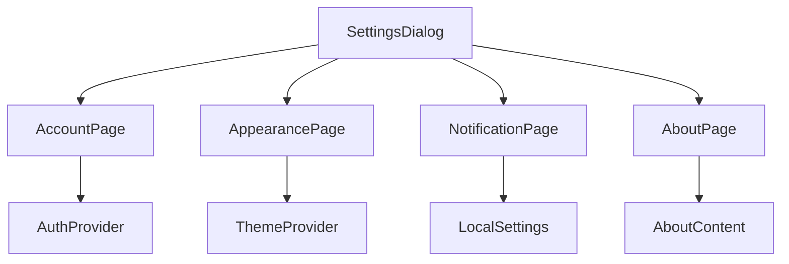
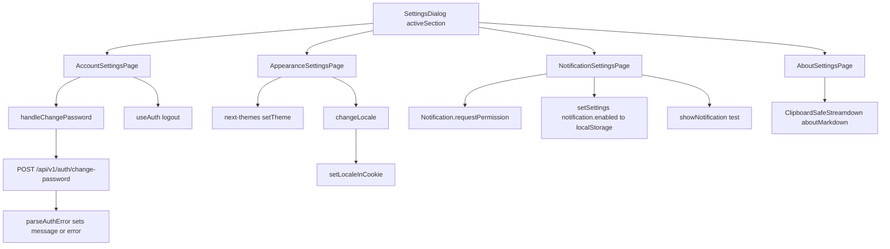

<title>307｜Workspace Account/Appearance/Notification/About 页面细节</title>

<callout emoji="✅">
**本章目标：**补齐剩余 frontend/UI/misc 模块。
</callout>

| 模块点 | 说明 |
|-|-|
| account-settings-page.tsx | 账号设置页面。 |
| appearance-settings-page.tsx | 主题外观设置。 |
| notification-settings-page.tsx | 通知设置。 |
| about-settings-page.tsx | 关于页面。 |
| settings-section.tsx | 通用 section 布局。 |

---

# 补充：设计取舍、重点代码与阅读路径

<callout emoji="💡">
**设计目的：**这些 Settings 页面把账号、外观、通知和关于信息拆成独立 section，避免设置弹窗变成一个巨型组件。
</callout>

| 维度 | 说明 |
|-|-|
| 收益 | 每个设置页面只负责自己的表单状态和副作用，SettingsDialog 只负责 section 切换。 |
| 代价 | 账号、主题、通知、语言分别依赖 auth API、next-themes、browser permission、i18n cookie/context。 |
| 重点代码 | `frontend/src/components/workspace/settings/account-settings-page.tsx`、`frontend/src/components/workspace/settings/appearance-settings-page.tsx`、`frontend/src/components/workspace/settings/notification-settings-page.tsx`、`frontend/src/components/workspace/settings/about-settings-page.tsx`。 |
| 阅读路径 | 先看 SettingsDialog 如何选择 section，再分别追每个页面的状态、提交和错误提示。 |

## 页面状态流补充

| 页面 | 状态/动作 | 源码入口 |
|-|-|-|
| Account | `currentPassword/newPassword/confirmPassword` -> CSRF POST `/api/v1/auth/change-password` -> success/error message -> optional logout | `frontend/src/components/workspace/settings/account-settings-page.tsx` |
| Appearance | theme card -> `next-themes.setTheme()`；language select -> `changeLocale()` -> cookie/context update | `frontend/src/components/workspace/settings/appearance-settings-page.tsx`、`frontend/src/core/i18n/hooks.ts` |
| Notification | browser support check -> permission `default/denied/granted` -> local setting `notification.enabled` -> test notification | `frontend/src/components/workspace/settings/notification-settings-page.tsx`、`frontend/src/core/settings/local.ts` |
| About | static markdown -> `ClipboardSafeStreamdown` | `frontend/src/components/workspace/settings/about-settings-page.tsx`、`frontend/src/components/workspace/settings/about-content.ts` |
