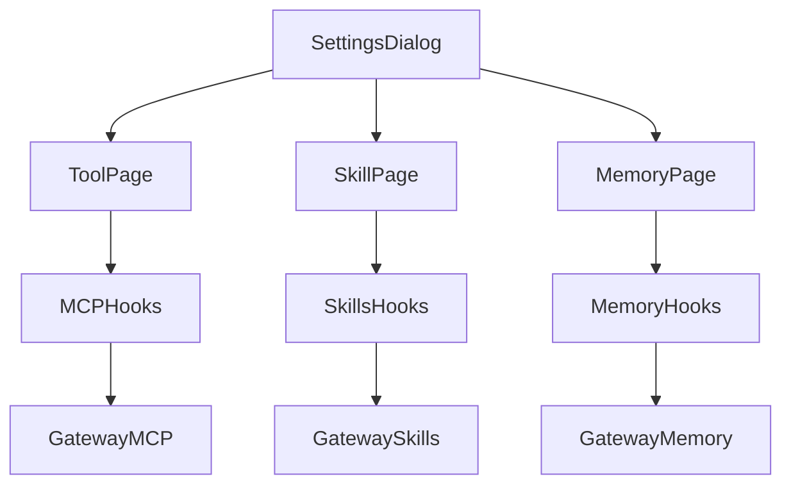
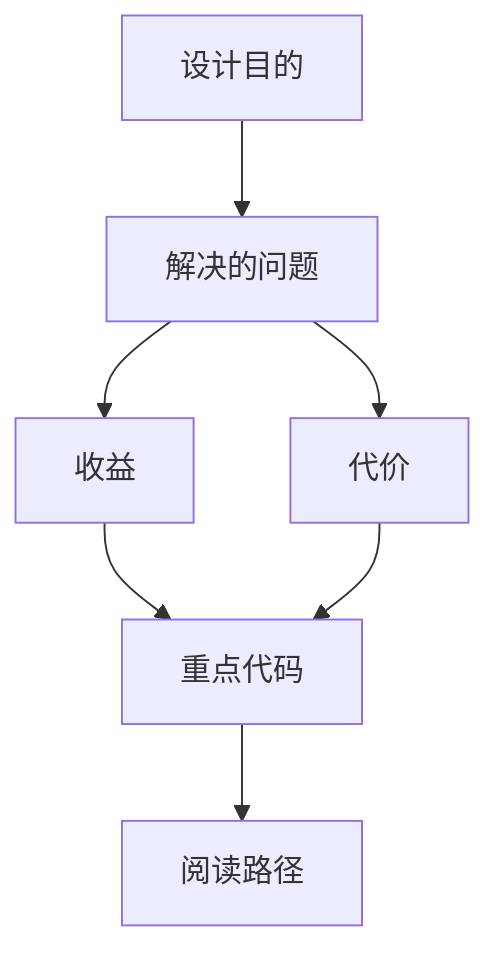

<title>308｜Workspace Tool/Skill/Memory Settings 页面细节</title>

<callout emoji="✅">
**本章目标：**补齐剩余 frontend/UI/misc 模块。
</callout>

| 模块点 | 说明 |
|-|-|
| tool-settings-page.tsx | MCP tools 配置。 |
| skill-settings-page.tsx | skills 启停与创建。 |
| memory-settings-page.tsx | memory facts/summaries。 |
| settings-dialog.tsx | section 切换。 |

---

# 补充：设计取舍、重点代码与阅读路径

<callout emoji="💡">
**设计目的：**Tool/Skill/Memory Settings 页面把可扩展能力的后端管理 API 接入到 Settings 弹窗，并通过 React Query 管理加载、错误和缓存失效。
</callout>

| 维度 | 说明 |
|-|-|
| 收益 | MCP、Skills、Memory 的列表、启停、CRUD、导入导出都有统一 UI 入口。 |
| 代价 | 每页都跨前端 hook、Gateway API、缓存失效和静态站点禁用分支。 |
| 重点代码 | `tool-settings-page.tsx`、`skill-settings-page.tsx`、`memory-settings-page.tsx`、`frontend/src/core/mcp/`、`frontend/src/core/skills/`、`frontend/src/core/memory/`。 |
| 阅读路径 | 先看页面如何调用 hook，再看 hook 如何调用 API 和更新 React Query cache。 |

## Settings 数据流补充

| 页面 | 数据源 | 写入/副作用 |
|-|-|-|
| Tools | `useMCPConfig()` -> `loadMCPConfig()` | `useEnableMCPServer()` 更新 config，成功后 invalidate `mcpConfig`；静态站点禁用 switch。 |
| Skills | `useSkills()` -> `loadSkills()` | `useEnableSkill()` 后 invalidate `skills`；Create Skill 关闭弹窗并跳转 `/workspace/chats/new?mode=skill`。 |
| Memory | `useMemory()` -> `loadMemory()` | clear/delete/import/create/update 直接更新 React Query `memory` cache；export 走 `exportMemory()`。 |
