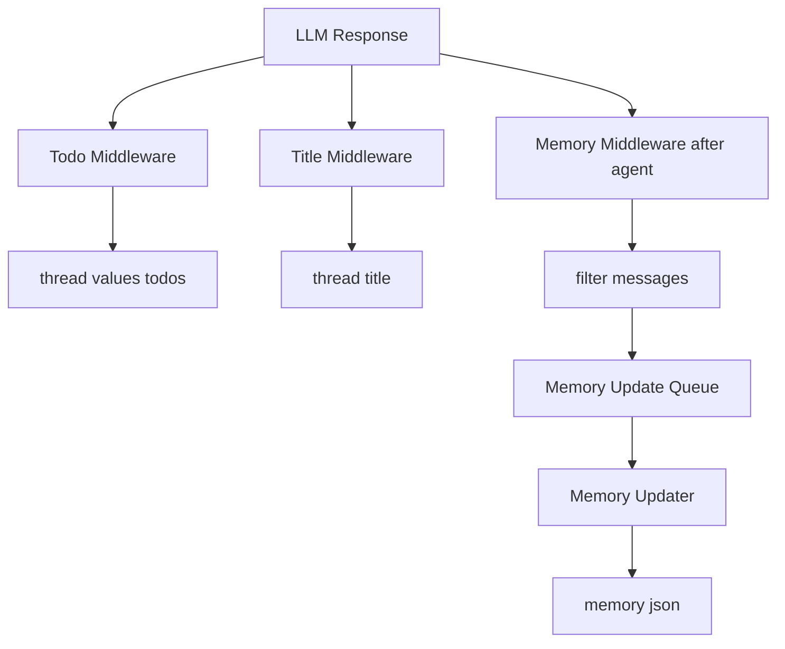
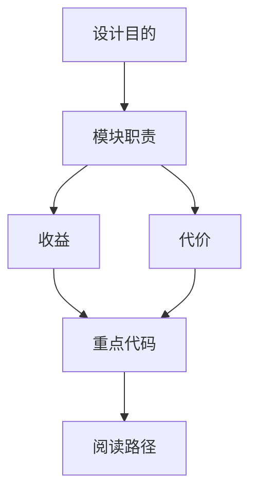

<title>30｜Todo、Title、Memory Middleware 文件详解</title>

<callout emoji="✅">
**本章目标：**把 Todo、Title、Memory 三个用户可见效果最强的 middleware 放在一篇里逐项讲清。
</callout>

| Middleware | 触发 | 结果 |
|-|-|-|
| TodoMiddleware | is_plan_mode=true，模型使用 write_todos | thread.values.todos 更新，前端 TodoList 展示。 |
| TitleMiddleware | 首个完整 user/assistant exchange 后 | 生成 title 写入 state，run 收尾同步到 thread meta。 |
| MemoryMiddleware | after_agent，memory.enabled=true | 过滤对话并入队，异步 LLM 更新 memory.json。 |

## 补充：Todo、Title、Memory 简化运行图

---

# 补充：设计取舍、重点代码与阅读路径

<callout emoji="💡">
**设计目的：**这个模块采用 middleware 形态，是为了把横切能力从主 agent 逻辑里剥离出来，并按 LangChain/LangGraph 生命周期挂载。
</callout>

| 维度 | 说明 |
|-|-|
| 收益 | 收益是可插拔、可独立测试、能按 before/after/wrap 阶段控制行为。 |
| 代价 | 代价是执行顺序不直观，多个 middleware 同时改 messages/state 时调试成本较高。 |
| 重点代码 | 重点代码通常在 `backend/packages/harness/deerflow/agents/middlewares/`，先看 class 的 hook 方法。 |
| 阅读路径 | 阅读路径：先判断它在哪个 hook 生效，再看它读写 ThreadState 的哪些字段。 |

