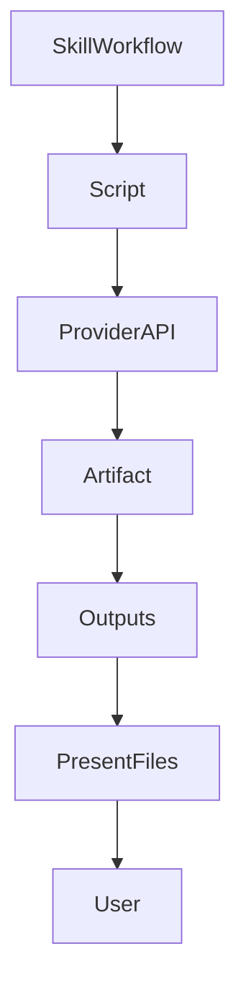
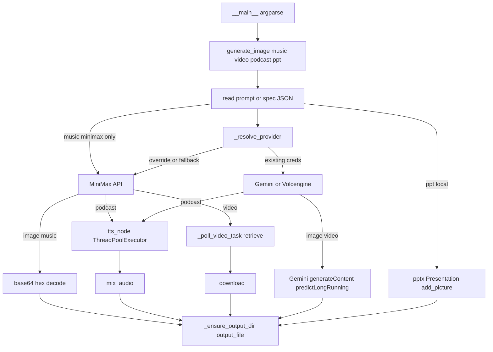

<title>318｜Generation Skill Scripts 单文件族详解</title>

<callout emoji="✅">
**本章目标：**继续拆更细 backend/frontend/skill scripts 模块。
</callout>

| 模块点 | 说明 |
|-|-|
| image-generation/scripts/generate.py | 图片生成脚本。 |
| music-generation/scripts/generate.py | 音乐生成脚本。 |
| video-generation/scripts/generate.py | 视频生成脚本。 |
| podcast/ppt scripts | 生成型 skill 脚本。 |

---

# 补充：设计取舍、重点代码与阅读路径

<callout emoji="💡">
**设计目的：**该文档说明前端 UI primitive、workspace 组件或页面模块的职责、状态来源和渲染分支。
</callout>

| 维度 | 说明 |
|-|-|
| 收益 | 组件边界清晰后，UI 问题可按 props/state/hook/route 快速定位。 |
| 代价 | 一次交互常跨页面、hook、context 和展示组件，需要按数据流追踪。 |
| 重点代码 | 标题对应的 `frontend/src/app/`、`frontend/src/components/` 或 `frontend/src/core/` 文件。 |
| 阅读路径 | 先看组件输入输出，再看状态来源，最后看事件回调如何改变 UI。 |

