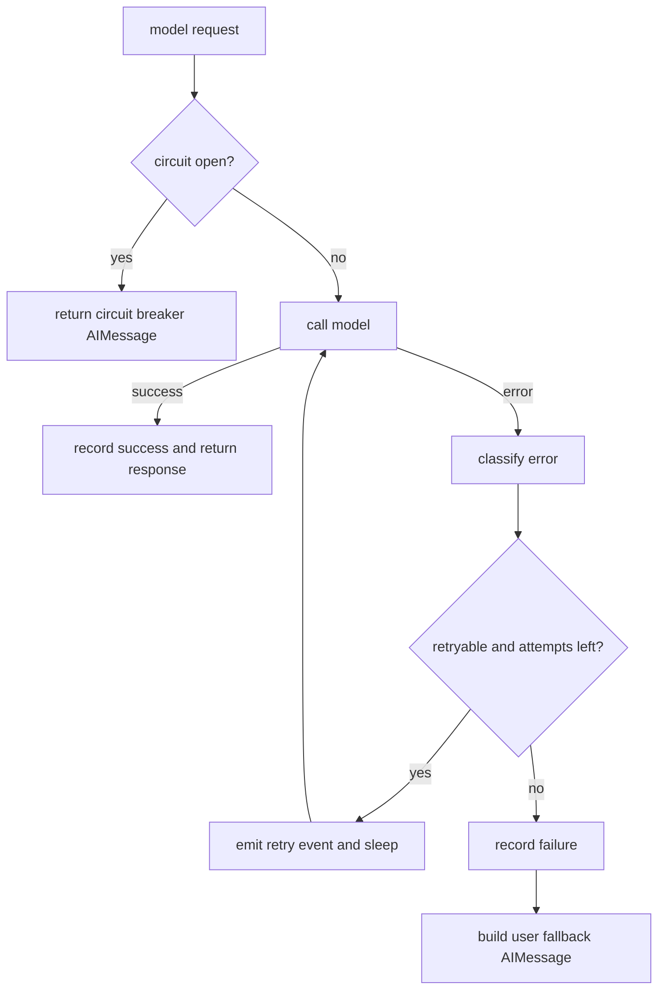
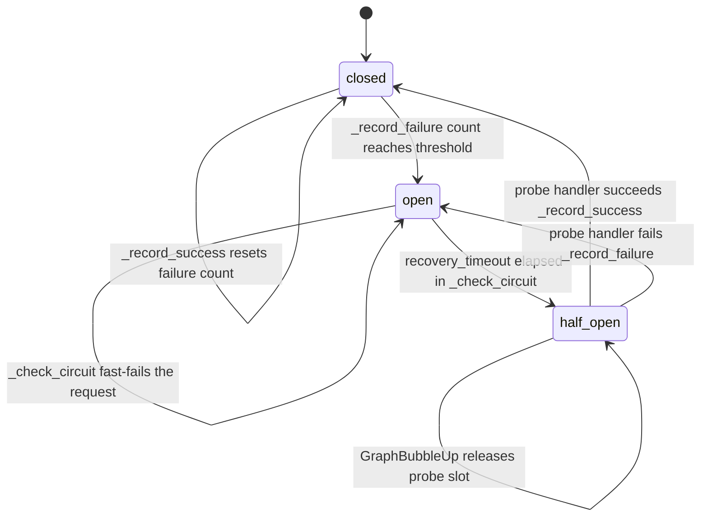

<title>31｜LLMErrorHandlingMiddleware 单文件详解</title>

<callout emoji="✅">
**本章目标：**讲清模型调用异常如何分类、重试、熔断，并转换为用户可理解的 fallback message。
</callout>

| 模块点 | 说明 |
|-|-|
| Hook | `wrap_model_call/awrap_model_call` 包裹模型请求。 |
| 分类 | quota/auth/transient/busy/generic。 |
| 重试 | 按异常类型和 retry-after 计算退避。 |
| 熔断 | 连续失败时 circuit breaker 保护 provider。 |
| UI 反馈 | 通过 custom event 发出 llm_retry toast。 |

---

# 补充：设计取舍、重点代码与阅读路径

<callout emoji="💡">
**设计目的：**这个模块采用 middleware 形态，是为了把横切能力从主 agent 逻辑里剥离出来，并按 LangChain/LangGraph 生命周期挂载。
</callout>

| 维度 | 说明 |
|-|-|
| 收益 | 收益是可插拔、可独立测试、能按 before/after/wrap 阶段控制行为。 |
| 代价 | 代价是执行顺序不直观，多个 middleware 同时改 messages/state 时调试成本较高。 |
| 重点代码 | 重点代码通常在 `backend/packages/harness/deerflow/agents/middlewares/`，先看 class 的 hook 方法。 |
| 阅读路径 | 阅读路径：先判断它在哪个 hook 生效，再看它读写 ThreadState 的哪些字段。 |

