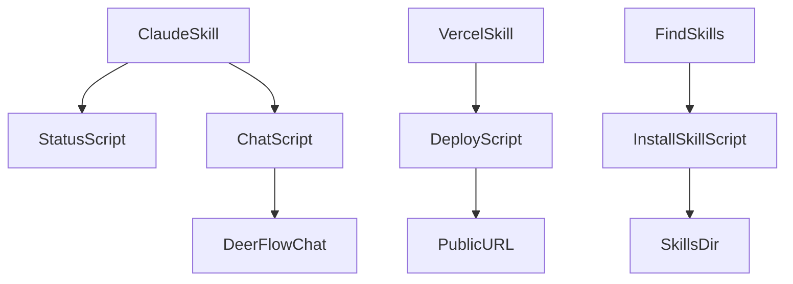
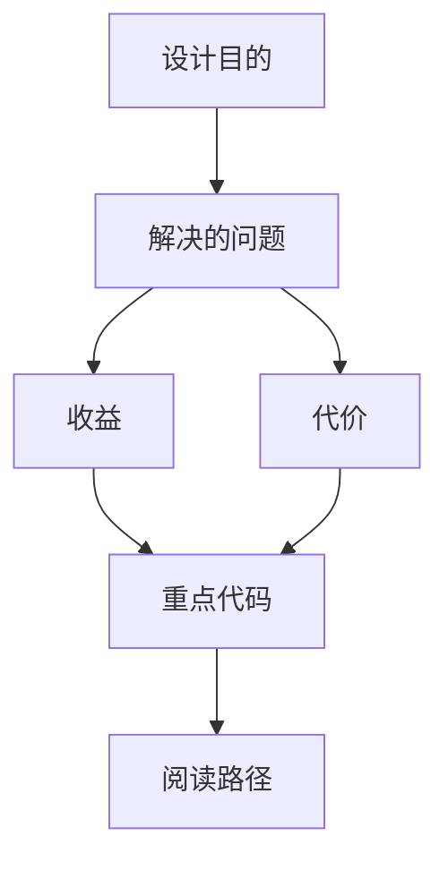

<title>320｜Claude/Vercel/Find Skills Scripts 详解</title>

<callout emoji="✅">
**本章目标：**继续拆更细 backend/frontend/skill scripts 模块。
</callout>

| 模块点 | 说明 |
|-|-|
| claude-to-deerflow/scripts/status.sh | 状态检查。 |
| claude-to-deerflow/scripts/chat.sh | 聊天脚本。 |
| vercel-deploy-claimable/scripts/deploy.sh | Vercel 部署。 |
| find-skills/scripts/install-skill.sh | 安装 skill。 |

---

# 补充：设计取舍、重点代码与阅读路径

<callout emoji="💡">
**设计目的：**该模块用于固化工程流程、质量门禁或设计背景，是为了让行为可复现、可审计。
</callout>

| 维度 | 说明 |
|-|-|
| 收益 | 收益是降低回归风险，帮助新人理解历史决策。 |
| 代价 | 代价是容易与代码实现漂移，需要持续维护。 |
| 重点代码 | 重点代码/资料是对应 tests、scripts、workflow、docs 文件及其调用的源码入口。 |
| 阅读路径 | 阅读路径：按输入、执行步骤、输出证据三段看。 |

