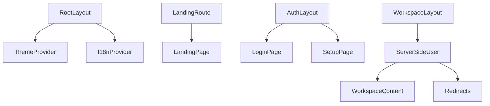
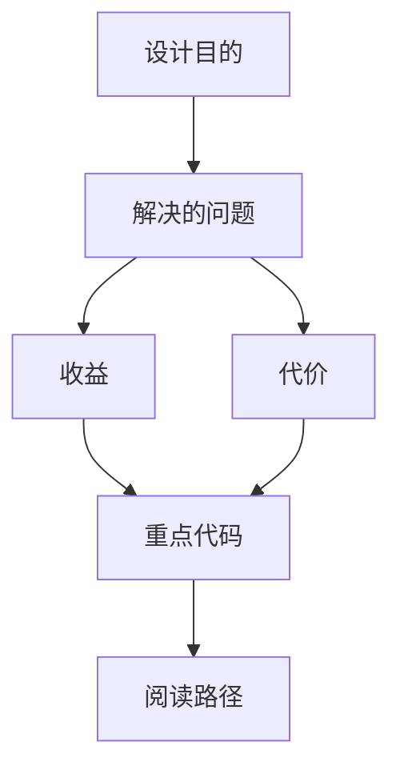

<title>323｜Frontend Root/Auth/Workspace Page Layout 深拆</title>

<callout emoji="✅">
**本章目标：**继续拆 backend tests、frontend pages、docker/provisioner、wizard step 模块。
</callout>

| 模块点 | 说明 |
|-|-|
| app/layout.tsx | Root layout、ThemeProvider、I18nProvider。 |
| app/page.tsx | Landing page。 |
| app/(auth)/layout.tsx | Auth layout。 |
| app/(auth)/login/page.tsx | 登录页。 |
| app/(auth)/setup/page.tsx | 初始化/改密码页。 |
| app/workspace/layout.tsx | workspace 鉴权布局。 |

---

# 补充：设计取舍、重点代码与阅读路径

<callout emoji="💡">
**设计目的：**前端按 route、core 数据层、业务组件、UI primitive 分层，是为了降低组件耦合。
</callout>

| 维度 | 说明 |
|-|-|
| 收益 | 收益是展示层和数据请求分离，组件更容易复用。 |
| 代价 | 代价是一次用户交互常跨页面、hook、缓存、上下文和组件。 |
| 重点代码 | 重点代码在 `frontend/src/app`、`frontend/src/core`、`frontend/src/components` 对应模块。 |
| 阅读路径 | 阅读路径：先找 route，再找 hook 数据源，最后看组件消费。 |

