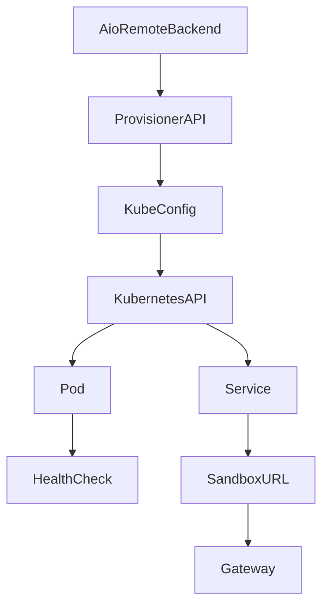
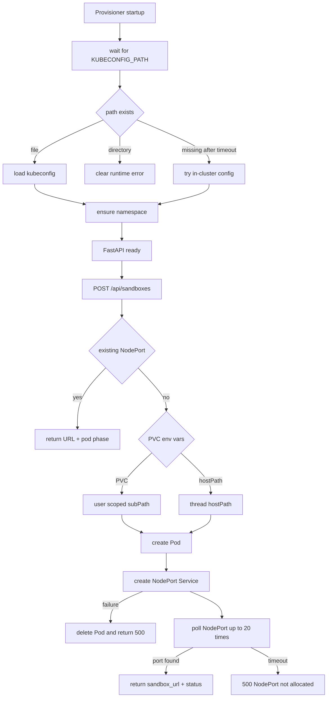

<title>325｜Docker Provisioner Kubernetes Flow 深拆</title>

<callout emoji="✅">
**本章目标：**继续拆 backend tests、frontend pages、docker/provisioner、wizard step 模块。
</callout>

| 模块点 | 说明 |
|-|-|
| provisioner/app.py | FastAPI provisioner。 |
| Dockerfile | provisioner 镜像。 |
| README.md | 使用说明。 |
| tests/test_provisioner\_\* | kubeconfig/PVC/volumes 测试。 |

## 关键状态与分支

| 阶段 | 源码 | 关键分支 |
|-|-|-|
| startup | `_wait_for_kubeconfig()`、`_init_k8s_client()`、`_ensure_namespace()` | kubeconfig 文件存在则加载；目录路径直接报错；缺失后尝试 in-cluster config；namespace 不存在则创建。 |
| create sandbox | `create_sandbox()` | 已有 NodePort 时直接返回；否则先建 Pod，再建 Service。 |
| volume mount | `_build_volumes()`、`_build_volume_mounts()` | `SKILLS_PVC_NAME`/`USERDATA_PVC_NAME` 存在时走 PVC；否则走 hostPath；PVC user-data 使用 `deer-flow/users/{user_id}/threads/{thread_id}/user-data` subPath。 |
| failure handling | `create_sandbox()` | Service 创建失败时回滚 Pod；NodePort 20 次轮询未拿到时报 500。 |

