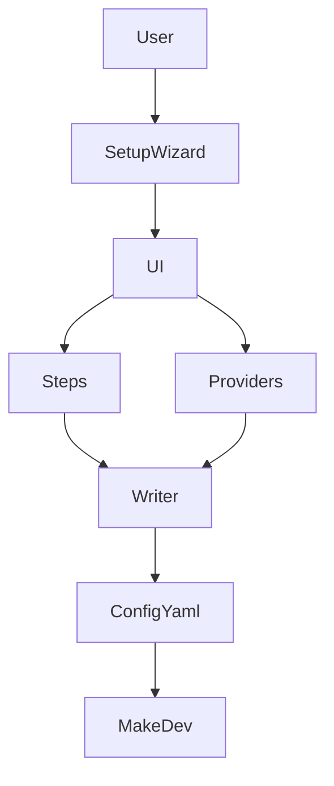
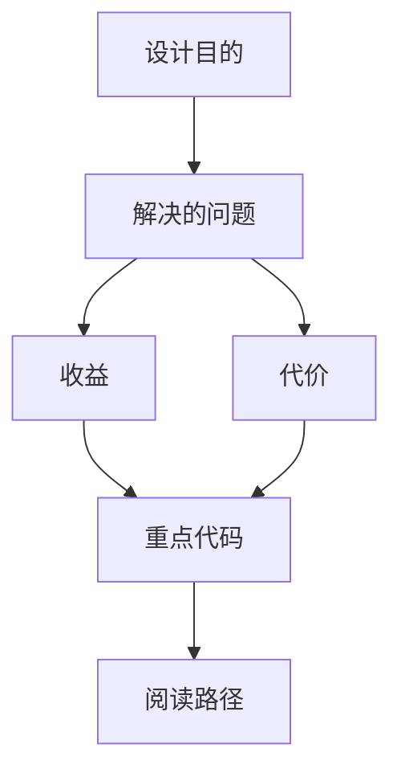
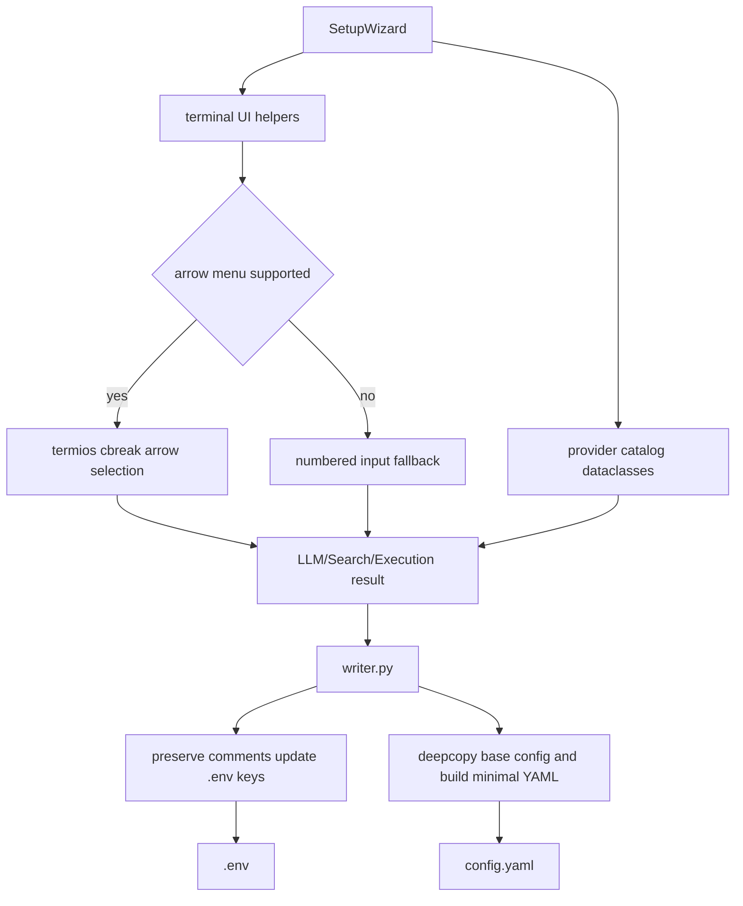

<title>327｜Wizard UI / Writer / Providers 深拆</title>

<callout emoji="✅">
**本章目标：**继续拆 backend tests、frontend pages、docker/provisioner、wizard step 模块。
</callout>

| 模块点 | 说明 |
|-|-|
| ui.py | 交互 UI 组件。 |
| writer.py | 配置写入逻辑。 |
| providers.py | 模型/搜索 provider 定义。 |
| setup_wizard.py | 总入口编排。 |

---

# 补充：设计取舍、重点代码与阅读路径

<callout emoji="💡">
**设计目的：**Wizard UI/Writer/Providers 把终端输入、provider 目录和配置落盘分开：`scripts/wizard/ui.py` 只负责交互，`scripts/wizard/providers.py` 只描述候选项，`scripts/wizard/writer.py` 才负责合并 `.env` 与 `config.yaml`。
</callout>

| 维度 | 说明 |
|-|-|
| 收益 | 新增 provider 或调整写盘逻辑时边界清晰，不需要改动所有 step。 |
| 代价 | 一次配置结果跨 `scripts/setup_wizard.py`、step result、provider extra_config 和 writer 合并逻辑，需要按数据流追。 |
| 重点代码 | `scripts/wizard/ui.py` 的 `ask_choice/ask_text/ask_secret`，`scripts/wizard/providers.py` 的 provider dataclass/catalogue，以及 `scripts/wizard/writer.py` 的 `write_env_file/write_config_yaml/build_config_yaml`。 |
| 阅读路径 | 先看 `scripts/wizard/providers.py` 数据结构，再看 `scripts/wizard/ui.py` 如何收集选择，最后看 `scripts/wizard/writer.py` 如何保留已有注释并更新 key。 |

