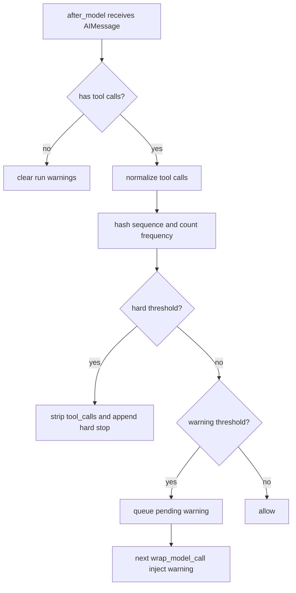
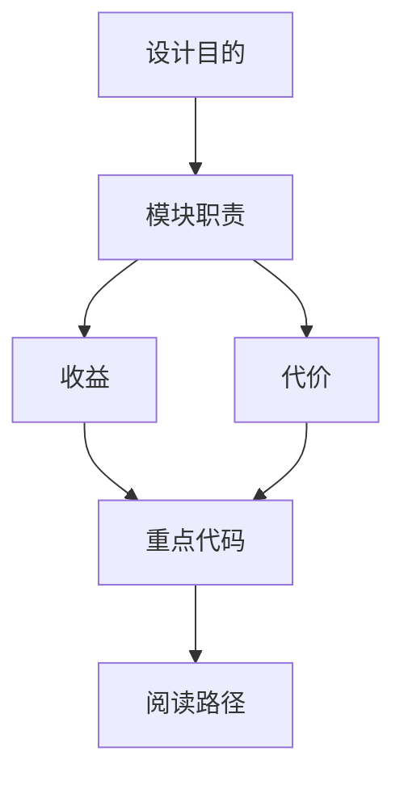

<title>32｜LoopDetectionMiddleware 单文件详解</title>

<callout emoji="✅">
**本章目标：**讲清重复工具调用如何被检测、预警和硬停止，避免 agent 陷入循环。
</callout>

| 机制 | 说明 |
|-|-|
| after_model | 观察最新 AIMessage 的 tool_calls，计算稳定 hash 和工具频率。 |
| pending warning | warning 不在 after_model 直接插，而是在下一次 wrap_model_call 注入。 |
| hard stop | 达到硬阈值时清空 tool_calls 并追加说明。 |
| reset | 按 thread/run 维护状态并清理旧 key。 |

---

# 补充：设计取舍、重点代码与阅读路径

<callout emoji="💡">
**设计目的：**这个模块采用 middleware 形态，是为了把横切能力从主 agent 逻辑里剥离出来，并按 LangChain/LangGraph 生命周期挂载。
</callout>

| 维度 | 说明 |
|-|-|
| 收益 | 收益是可插拔、可独立测试、能按 before/after/wrap 阶段控制行为。 |
| 代价 | 代价是执行顺序不直观，多个 middleware 同时改 messages/state 时调试成本较高。 |
| 重点代码 | 重点代码通常在 `backend/packages/harness/deerflow/agents/middlewares/`，先看 class 的 hook 方法。 |
| 阅读路径 | 阅读路径：先判断它在哪个 hook 生效，再看它读写 ThreadState 的哪些字段。 |

