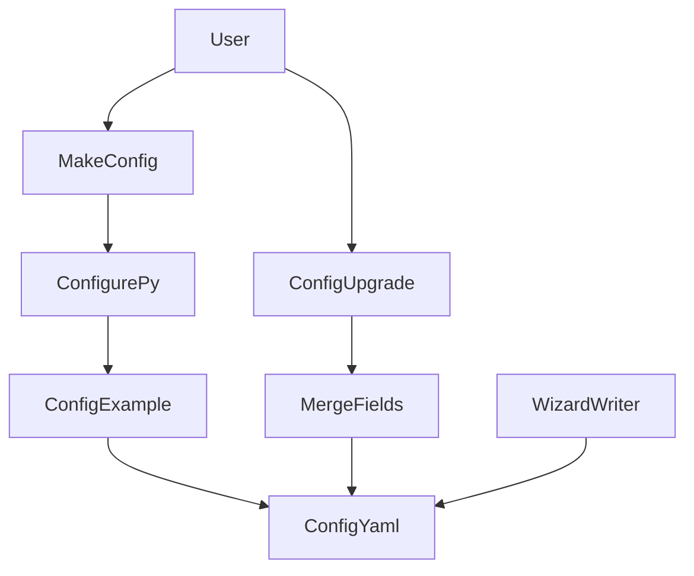

<title>333｜configure.py 与 config-upgrade.sh 深拆</title>

<callout emoji="✅">
**本章目标：**继续拆 remaining route/content/docker/script 内部模块。
</callout>

| 模块点 | 说明 |
|-|-|
| configure.py | 从模板生成 config.yaml。 |
| config-upgrade.sh | 合并新字段。 |
| config.example.yaml | 模板来源。 |
| wizard/writer.py | wizard 写入配置。 |

