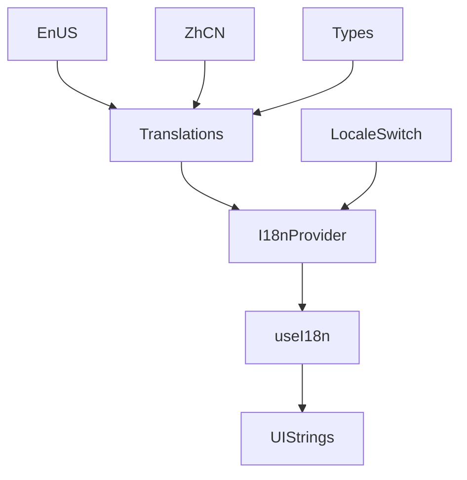
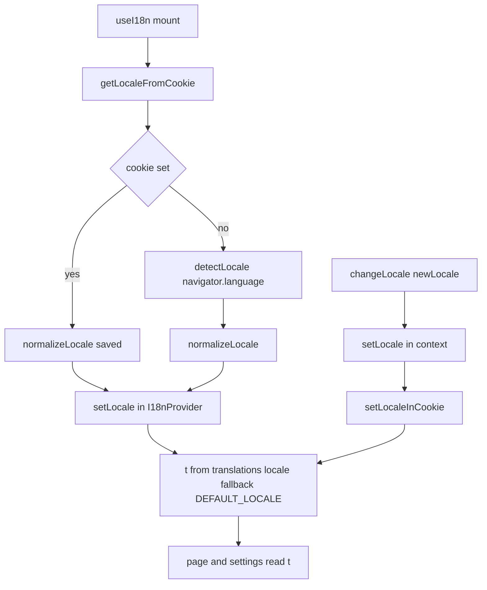

<title>347｜I18n Locales 与 Translations 详解</title>

<callout emoji="✅">
**本章目标：**继续细化前端 UI/Landing/I18n 模块。
</callout>

| 模块点 | 说明 |
|-|-|
| locales/en-US.ts | 英文文案。 |
| locales/zh-CN.ts | 中文文案。 |
| locales/types.ts | 翻译类型。 |
| translations.ts | 聚合翻译。 |
| locales/index.ts | 导出。 |

---

# 补充：设计取舍、重点代码与阅读路径

<callout emoji="💡">
**设计目的：**i18n locales/translations 把所有前端文案集中成类型化对象，`I18nProvider` 根据当前 locale 选择 `translations[locale]` 并通过 `useI18n()` 暴露给组件。
</callout>

| 维度 | 说明 |
|-|-|
| 收益 | 组件不直接硬编码多语言文案，新增语言时能按 `Translations` 类型补齐。 |
| 代价 | 新增字段必须同步 `frontend/src/core/i18n/locales/types.ts`、`frontend/src/core/i18n/locales/en-US.ts`、`frontend/src/core/i18n/locales/zh-CN.ts`，否则运行时取文案会缺失或类型检查失败。 |
| 重点代码 | `frontend/src/core/i18n/locales/types.ts`、`frontend/src/core/i18n/locales/en-US.ts`、`frontend/src/core/i18n/locales/zh-CN.ts`、`frontend/src/core/i18n/translations.ts`、`frontend/src/core/i18n/context.tsx`、`frontend/src/core/i18n/hooks.ts`。 |
| 阅读路径 | 先看 `Translations` 类型，再看两个 locale 文件如何实现，最后看 `useI18n()` 如何把 `t` 提供给页面和设置弹窗。 |

