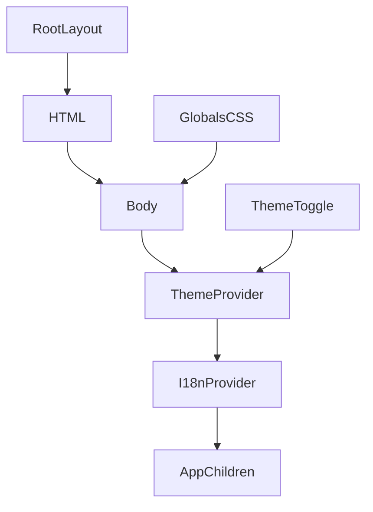

<title>348｜ThemeProvider 与 Global Layout 详解</title>

<callout emoji="✅">
**本章目标：**继续细化前端 UI/Landing/I18n 模块。
</callout>

| 模块点 | 说明 |
|-|-|
| theme-provider.tsx | next-themes wrapper。 |
| app/layout.tsx | RootLayout。 |
| globals.css | 全局样式。 |
| body/html | 主题和 hydration 设置。 |

