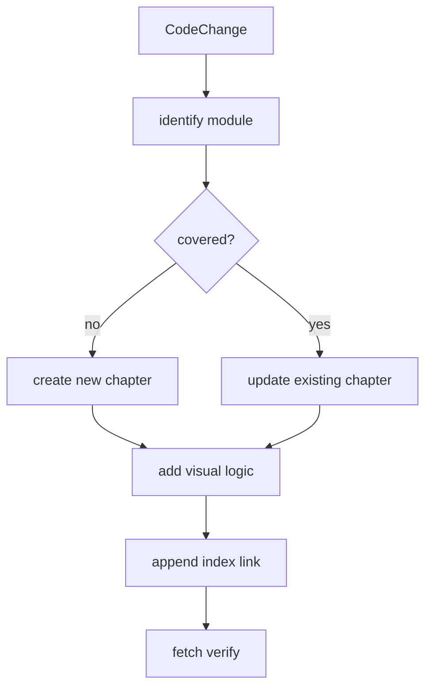

<title>351｜文档集维护指南：新增模块后的补文档方法</title>

<callout emoji="✅">
**本章目标：**说明后续 DeerFlow 新增模块后，如何延续“一模块一文档 + 可视化图”的规则。
</callout>

## 本轮源码校准补充：维护与同步规则

| 步骤 | 要做什么 |
|-|-|
| 1. 选 canonical | 默认 `.agent_context/final_review/docs_md/` 是本地 canonical。 |
| 2. token-keyed ledger | 用 `.agent_context/lark_remote/sync_ledger.jsonl` 记录 sequence、token、URL、local path、action、warning。 |
| 3. diff | 用 `.agent_context/lark_remote/compare_manifest.json` 区分 matched、same SHA、drifted、missing remote。 |
| 4. merge | drifted 远端有 `# 可视化增强` 时，不要盲目覆盖；先合并或记录拒绝理由。 |
| 5. publish | 只更新本批目标文档，避免 355 篇全量覆盖。 |
| 6. verify | update 后 refetch，记录 chars/sha/mermaid/warnings。 |

| 变更类型 | 维护动作 |
|-|-|
| 新增后端文件 | 新增一篇对应模块文档，补运行图和关键函数表。 |
| 新增前端组件 | 补组件输入/状态/输出图。 |
| 新增测试 | 补测试目的、fixture、CI 关系。 |
| 新增 skill | 补 skill 目标、触发、工作流图。 |
| 新增配置 | 补配置到 runtime 的传播图。 |

