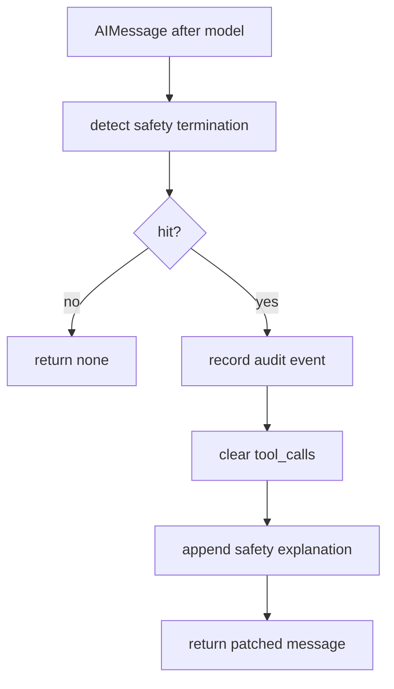
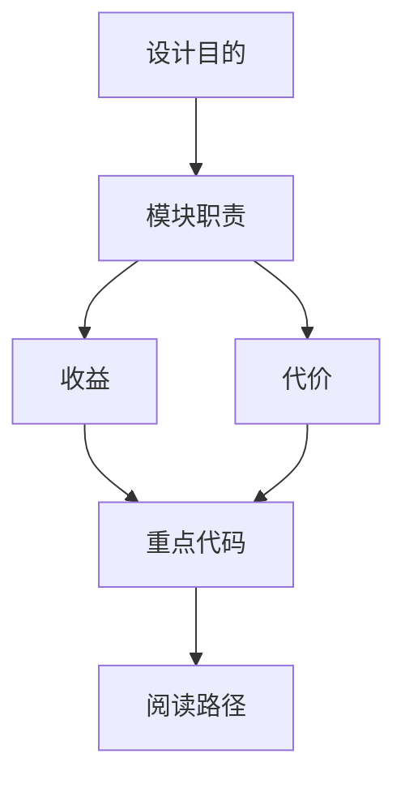

<title>35｜SafetyFinishReasonMiddleware 单文件详解</title>

<callout emoji="✅">
**本章目标：**讲清 provider 安全终止时，如何抑制半截 tool_calls，避免执行不完整或风险工具。
</callout>

| 点 | 说明 |
|-|-|
| Hook | after_model，处理正常返回但带 safety finish reason 的 AIMessage。 |
| detectors | OpenAI/Anthropic/Gemini 等 detector。 |
| 动作 | 清空 tool_calls，追加用户可读说明，记录 audit event。 |
| 目的 | 防止 provider 中途安全截断后仍执行半成型工具调用。 |

---

# 补充：设计取舍、重点代码与阅读路径

<callout emoji="💡">
**设计目的：**这个模块采用 middleware 形态，是为了把横切能力从主 agent 逻辑里剥离出来，并按 LangChain/LangGraph 生命周期挂载。
</callout>

| 维度 | 说明 |
|-|-|
| 收益 | 收益是可插拔、可独立测试、能按 before/after/wrap 阶段控制行为。 |
| 代价 | 代价是执行顺序不直观，多个 middleware 同时改 messages/state 时调试成本较高。 |
| 重点代码 | 重点代码通常在 `backend/packages/harness/deerflow/agents/middlewares/`，先看 class 的 hook 方法。 |
| 阅读路径 | 阅读路径：先判断它在哪个 hook 生效，再看它读写 ThreadState 的哪些字段。 |

