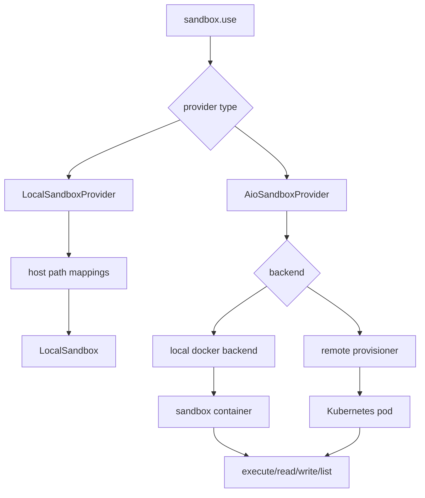
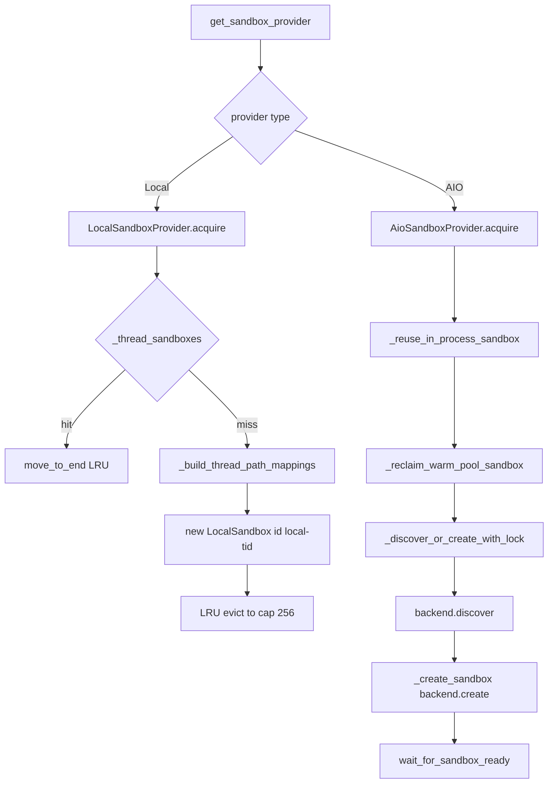

<title>38｜LocalSandbox 与 AioSandbox Provider 详解</title>

<callout emoji="✅">
**本章目标：**讲清本地 sandbox 与容器化 AioSandbox provider 的职责差异和路径映射。
</callout>

| Provider | 职责 | 适用场景 |
|-|-|-|
| `LocalSandboxProvider` | 使用宿主机文件系统路径映射，bash 默认禁用 | 本地开发、可信环境。 |
| `AioSandboxProvider` | 容器/远程 provisioner sandbox，支持 acquire/reuse/release | 隔离要求更高的开发或生产。 |
| `docker/provisioner` | 在 Kubernetes 中创建 sandbox Pod/Service | 集群部署。 |

---

# 补充：设计取舍、重点代码与阅读路径

<callout emoji="💡">
**设计目的：**这些模块负责扩展 agent 能力：skill 提供方法论，MCP 提供外部工具，memory 提供长期上下文。
</callout>

| 维度 | 说明 |
|-|-|
| 收益 | 收益是能力可扩展、可配置、可跨会话复用。 |
| 代价 | 代价是 prompt、工具、记忆三者都会影响模型行为，问题定位需要分层排查。 |
| 重点代码 | 重点代码在 `backend/packages/harness/deerflow/skills`、`mcp`、`agents/memory`。 |
| 阅读路径 | 阅读路径：把 skill 当说明书，MCP 当工具注册表，memory 当上下文注入源。 |

