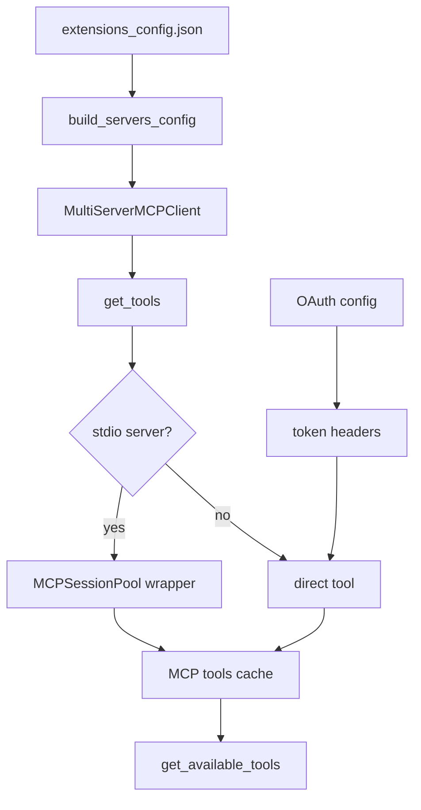
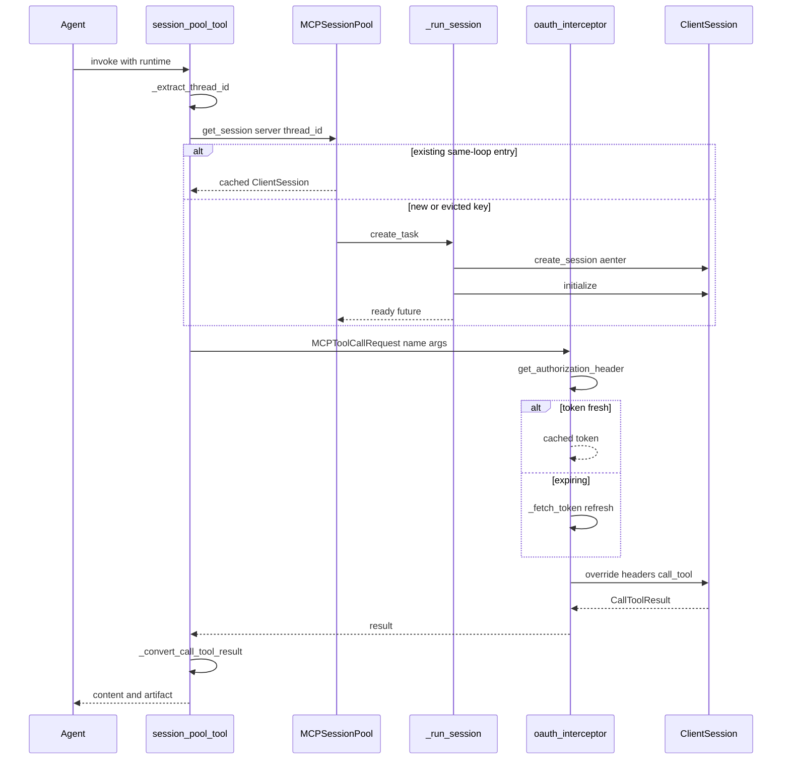

<title>39｜MCP Cache、Session Pool 与 OAuth 详解</title>

<callout emoji="✅">
**本章目标：**讲清 MCP 工具从 extensions_config 加载、缓存、stdio 会话复用和 OAuth token 注入。
</callout>

| 文件 | 职责 |
|-|-|
| `mcp/client.py` | 把 ExtensionsConfig 转成 MultiServerMCPClient server config。 |
| `mcp/tools.py` | 发现 MCP tools，包装 stdio session pool tool。 |
| `mcp/cache.py` | 缓存 MCP tools，并按 config mtime 判断 stale。 |
| `mcp/session_pool.py` | stdio MCP per-thread session 复用和清理。 |
| `mcp/oauth.py` | HTTP/SSE MCP OAuth token 获取、刷新、header 注入。 |

---

# 补充：设计取舍、重点代码与阅读路径

<callout emoji="💡">
**设计目的：**这些模块负责扩展 agent 能力：skill 提供方法论，MCP 提供外部工具，memory 提供长期上下文。
</callout>

| 维度 | 说明 |
|-|-|
| 收益 | 收益是能力可扩展、可配置、可跨会话复用。 |
| 代价 | 代价是 prompt、工具、记忆三者都会影响模型行为，问题定位需要分层排查。 |
| 重点代码 | 重点代码在 `backend/packages/harness/deerflow/skills`、`mcp`、`agents/memory`。 |
| 阅读路径 | 阅读路径：把 skill 当说明书，MCP 当工具注册表，memory 当上下文注入源。 |

