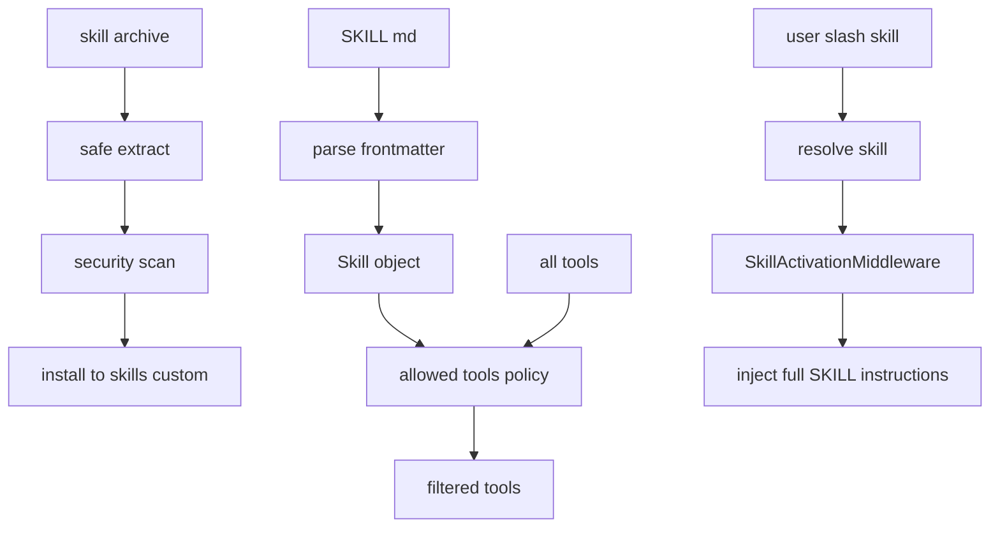
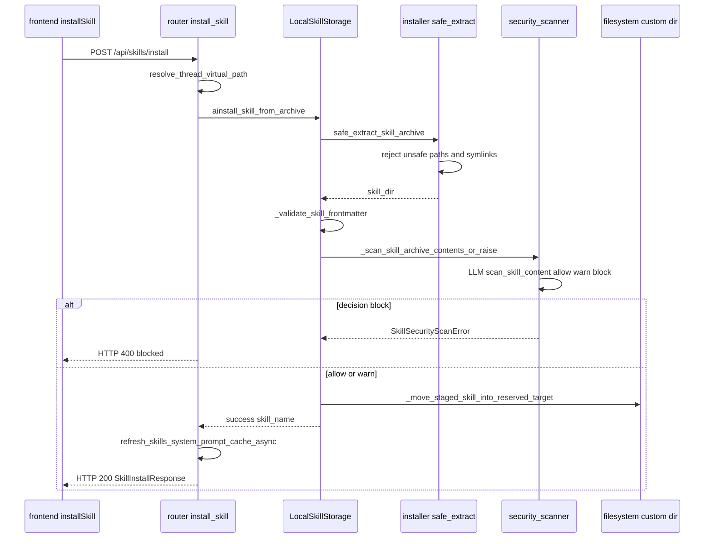

<title>41｜Skills Parser、Installer、Security Scanner 详解</title>

<callout emoji="✅">
**本章目标：**讲清 skill 从 SKILL.md 解析、压缩包安装、安全扫描到 allowed_tools 过滤的完整链路。
</callout>

| 文件 | 职责 |
|-|-|
| `skills/parser.py` | 解析 frontmatter、description、allowed_tools。 |
| `skills/installer.py` | 安全解压 .skill、扫描、移动到目标目录。 |
| `skills/security_scanner.py` | 用 LLM/规则扫描 skill 内容风险。 |
| `skills/tool_policy.py` | 根据 skill allowed_tools 过滤可用工具。 |
| `skills/slash.py` | 解析 /skill-name 显式激活。 |

## 补充：Skills 安装与激活简化运行图

---

# 补充：设计取舍、重点代码与阅读路径

<callout emoji="💡">
**设计目的：**Skills parser、installer 和 security scanner 把 `SKILL.md` 从普通 Markdown 变成可启停、可校验、可注入 prompt 的 agent 能力单元。
</callout>

| 维度 | 说明 |
|-|-|
| 收益 | public/custom skills 能用同一套 metadata、启停状态和安全检查进入 lead agent。 |
| 代价 | skill 内容、frontmatter、allowed tools、安装来源和 prompt cache 任一处出错都会影响激活效果。 |
| 重点代码 | `backend/packages/harness/deerflow/skills/`、`backend/app/gateway/routers/skills.py`、`frontend/src/core/skills/`。 |
| 阅读路径 | 先看 parser 如何读 `SKILL.md`，再看 storage/installer 如何管理 custom skill，最后看 router 和 middleware 如何启用。 |

