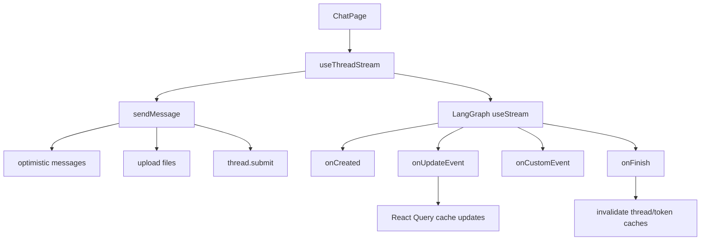
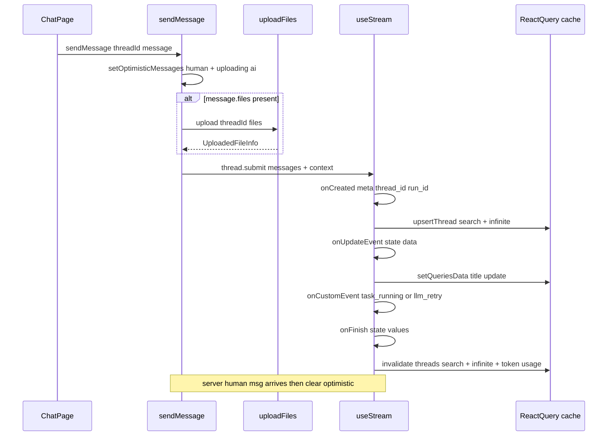

<title>42｜Frontend useThreadStream 单文件详解</title>

<callout emoji="✅">
**本章目标：**讲清 frontend/src/core/threads/hooks.ts 如何封装 LangGraph useStream、提交消息、处理历史和缓存。
</callout>

| 区域 | 职责 |
|-|-|
| `useThreadStream` | 核心 streaming hook，封装 useStream callbacks。 |
| `sendMessage` | 乐观 UI、文件上传、thread.submit。 |
| `mergeMessages` | 合并 optimistic/history/stream messages。 |
| `useThreadHistory` | 分页读取历史 run messages。 |
| `useInfiniteThreads` | 会话列表无限滚动。 |
| `useDeleteThread/useRenameThread` | 线程删除和重命名。 |

---

# 补充：设计取舍、重点代码与阅读路径

<callout emoji="💡">
**设计目的：**该文档用于把模块职责、运行逻辑、关键代码和阅读路径固定下来，帮助读者从源码验证行为。
</callout>

| 维度 | 说明 |
|-|-|
| 收益 | 读者可以按文档快速定位模块入口和上下游关系。 |
| 代价 | 文档需要随源码变更持续校准，避免模板化描述掩盖真实行为。 |
| 重点代码 | 标题对应的源码、测试或文档入口。 |
| 阅读路径 | 先看上游输入，再看核心函数，最后看下游输出和测试验证。 |

