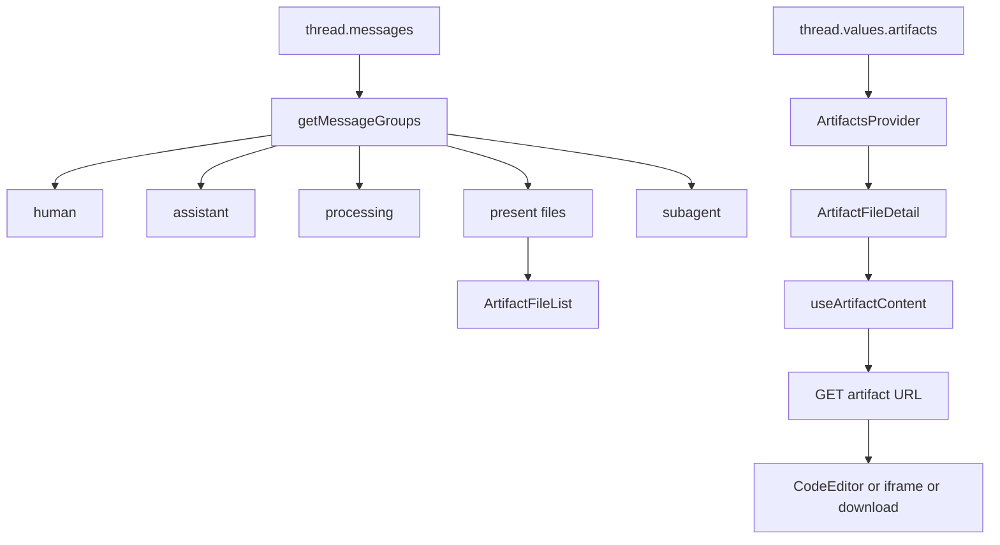
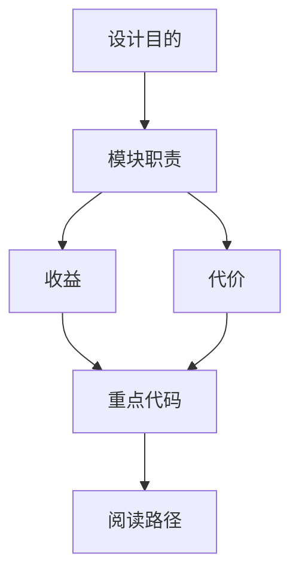

<title>43｜Frontend Message Utils 与 Artifacts Hooks 详解</title>

<callout emoji="✅">
**本章目标：**讲清消息分组、reasoning/content 提取、artifact 内容加载和 URL 构造。
</callout>

| 文件 | 职责 |
|-|-|
| `core/messages/utils.ts` | getMessageGroups、reasoning 提取、hidden message 过滤、uploaded files 解析。 |
| `components/workspace/messages/message-list.tsx` | 按 MessageGroup 渲染普通消息、processing、subagent、present files。 |
| `core/artifacts/utils.ts` | 构造 artifact URL、判断文件类型。 |
| `core/artifacts/hooks.ts` | useArtifactContent 拉取 artifact 内容。 |
| `components/workspace/artifacts/*` | 列表、详情、触发器、预览和安装 .skill。 |

---

# 补充：设计取舍、重点代码与阅读路径

<callout emoji="💡">
**设计目的：**这个模块单独成章，是为了把职责边界、运行逻辑和维护入口从大系统里抽出来。
</callout>

| 维度 | 说明 |
|-|-|
| 收益 | 收益是查找和学习更快，职责更聚焦。 |
| 代价 | 代价是章节数量增加，需要依赖目录和索引维护。 |
| 重点代码 | 重点代码见本章表格列出的源码路径。 |
| 阅读路径 | 阅读路径：先确认它在系统链路中的上游和下游，再看关键函数。 |

