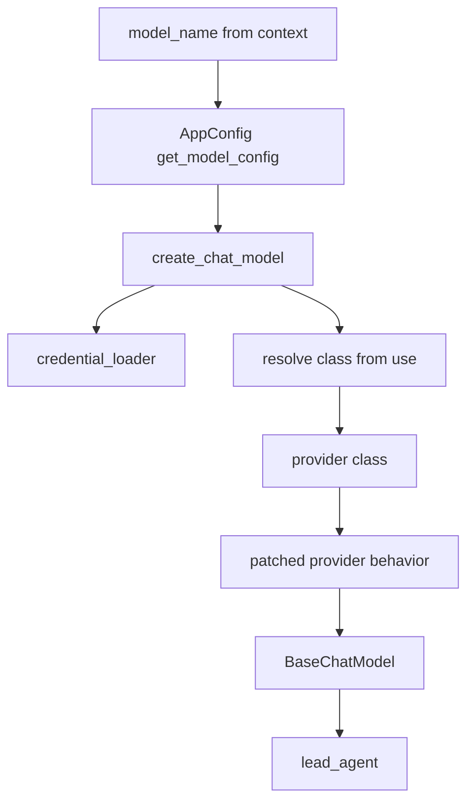
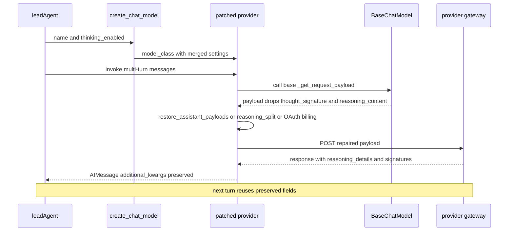

<title>45｜Models Provider Patch 文件详解</title>

<callout emoji="✅">
**本章目标：**把 models 包下 provider patch 文件逐一说明，帮助定位模型兼容问题。
</callout>

| 文件 | 职责 |
|-|-|
| `factory.py` | 统一 create_chat_model，解析 ModelConfig 和 class path。 |
| `credential_loader.py` | 解析 API key、credential、环境变量引用。 |
| `patched_openai.py` | OpenAI 兼容 provider patch。 |
| `patched_deepseek.py` | DeepSeek provider 兼容处理。 |
| `patched_minimax.py` | MiniMax reasoning/think block 适配。 |
| `claude_provider.py` | Claude provider 封装。 |
| `openai_codex_provider.py` | Codex/OpenAI 特定 provider。 |

---

# 补充：设计取舍、重点代码与阅读路径

<callout emoji="💡">
**设计目的：**这个模块单独成章，是为了把职责边界、运行逻辑和维护入口从大系统里抽出来。
</callout>

| 维度 | 说明 |
|-|-|
| 收益 | 收益是查找和学习更快，职责更聚焦。 |
| 代价 | 代价是章节数量增加，需要依赖目录和索引维护。 |
| 重点代码 | 重点代码见本章表格列出的源码路径。 |
| 阅读路径 | 阅读路径：先确认它在系统链路中的上游和下游，再看关键函数。 |

