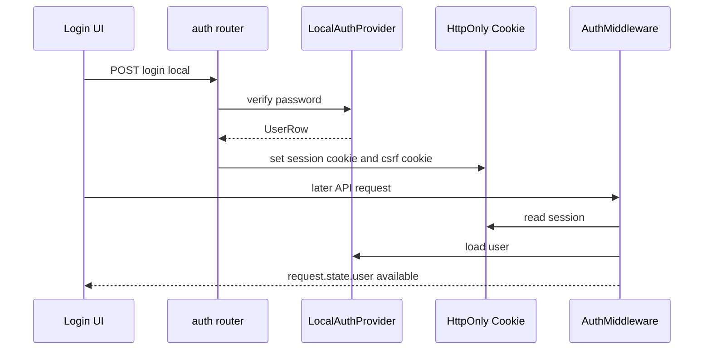
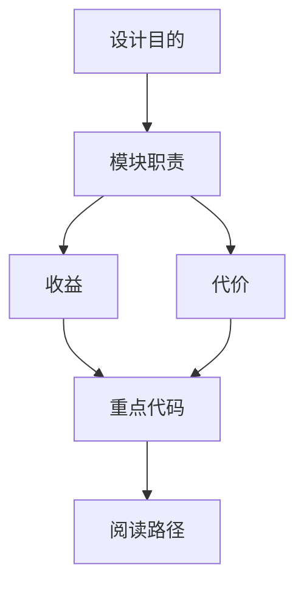

<title>48｜Gateway Auth Router 与认证模块详解</title>

<callout emoji="✅">
**本章目标：**把 auth.py、AuthMiddleware、CSRF、本地用户 provider 的协作讲清。
</callout>

| 模块 | 职责 |
|-|-|
| `routers/auth.py` | 登录、注册、退出、修改密码、初始化 admin、OAuth callback。 |
| `auth_middleware.py` | 请求级认证，把 user 写入 request.state。 |
| `csrf_middleware.py` | 状态变更请求 CSRF 校验。 |
| `auth/local_provider.py` | 本地用户认证 provider。 |
| `auth/password.py` | 密码 hash 和校验。 |

---

# 补充：设计取舍、重点代码与阅读路径

<callout emoji="💡">
**设计目的：**该文档用于把模块职责、运行逻辑、关键代码和阅读路径固定下来，帮助读者从源码验证行为。
</callout>

| 维度 | 说明 |
|-|-|
| 收益 | 读者可以按文档快速定位模块入口和上下游关系。 |
| 代价 | 文档需要随源码变更持续校准，避免模板化描述掩盖真实行为。 |
| 重点代码 | 标题对应的源码、测试或文档入口。 |
| 阅读路径 | 先看上游输入，再看核心函数，最后看下游输出和测试验证。 |

