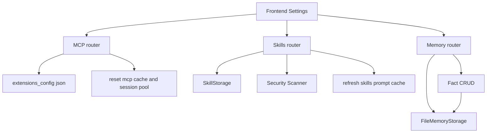
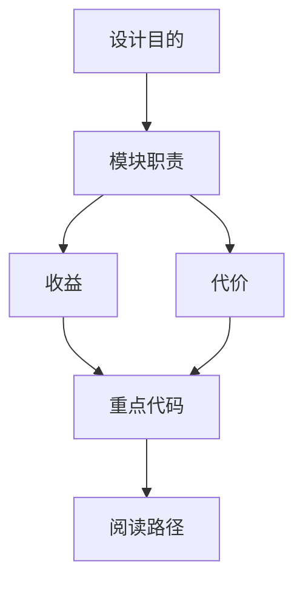

<title>49｜Gateway MCP、Skills、Memory Router 深入详解</title>

<callout emoji="✅">
**本章目标：**把三个最常被 Settings 调用的管理 router 放在一篇中深入说明。
</callout>

## 本轮源码校准补充：Gateway MCP、Skills、Memory Router

| Router | 前端入口 | 后端职责 |
|-|-|-|
| `backend/app/gateway/routers/mcp.py` | Tool settings | 管理 MCP server config、状态和工具发现。 |
| `backend/app/gateway/routers/skills.py` | Skill settings | 列出 public/custom skills，启停、安装、编辑 custom skill。 |
| `backend/app/gateway/routers/memory.py` | Memory settings | memory status、facts CRUD、import/export/reload/clear。 |

<callout emoji="💡">
这些 API 是 Settings 页的数据来源；但真正影响一次对话的是 `thread.submit` 的 context、lead_agent 装配和 middleware 注入。
</callout>

| Router | 读写对象 | 关键保护 |
|-|-|-|
| MCP | `extensions_config.json` 的 mcp_servers | mask secrets、stdio allowlist、admin required。 |
| Skills | skill storage、custom SKILL.md、extensions skill state | security scanner、history、rollback。 |
| Memory | memory.json / facts | per-user context、confidence 校验、import/export。 |

---

# 补充：设计取舍、重点代码与阅读路径

<callout emoji="💡">
**设计目的：**MCP、Skills、Memory router 把 Settings 页的管理操作落到后端配置、skill storage 和 memory storage 上，是为了把可变扩展能力集中到受控 API 边界。
</callout>

| 维度 | 说明 |
|-|-|
| 收益 | 扩展能力的读写、校验、secret mask、cache reset 都在 Gateway 侧闭环。 |
| 代价 | 一次设置变更可能同时影响持久配置、运行期 cache、prompt cache 或 memory 文件。 |
| 重点代码 | `backend/app/gateway/routers/mcp.py`、`backend/app/gateway/routers/skills.py`、`backend/app/gateway/routers/memory.py`。 |
| 阅读路径 | 先从 Settings 调用的 URL 找 router，再看 config/storage 操作和 cache/prompt reload。 |

