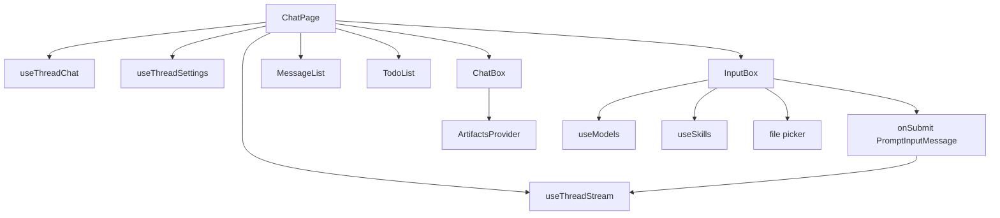
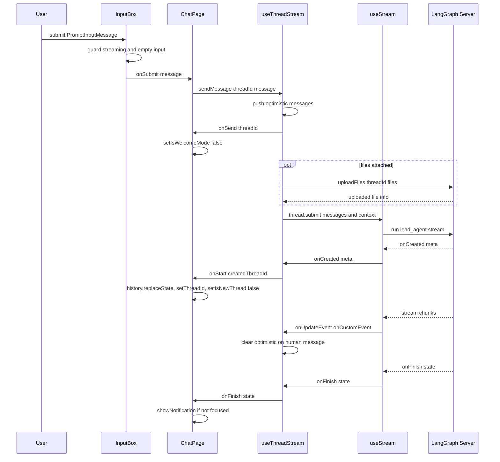

<title>50｜Frontend ChatPage 与 InputBox 文件详解</title>

<callout emoji="✅">
**本章目标：**把用户聊天页主装配和输入框上下文构造拆开讲。
</callout>

| 文件 | 职责 |
|-|-|
| `app/workspace/chats/[thread_id]/page.tsx` | ChatPage 主装配：thread 状态、settings、MessageList、InputBox、Todo、Artifacts。 |
| `components/workspace/input-box.tsx` | 文本输入、模型选择、mode/reasoning effort、文件上传、skill suggestion。 |
| `components/workspace/chats/use-thread-chat.ts` | /new 临时 thread id 和 URL replace。 |
| `components/workspace/chats/chat-box.tsx` | 聊天区和 artifacts 右侧面板布局。 |

---

# 补充：设计取舍、重点代码与阅读路径

<callout emoji="💡">
**设计目的：**ChatPage 负责把 thread 状态、stream hook、消息列表、输入框、Todo 和 Artifacts 面板装配到一起；InputBox 负责把用户输入、模型、mode、reasoning、文件和 skill suggestion 组装成提交事件。
</callout>

| 维度 | 说明 |
|-|-|
| 收益 | 页面装配、输入采集和 stream 状态分离，便于单独调试提交、展示和 artifacts。 |
| 代价 | 一次发送会跨 ChatPage callback、InputBox 表单状态、useThreadStream、LangGraph SDK 和右侧 artifact context。 |
| 重点代码 | `frontend/src/app/workspace/chats/[thread_id]/page.tsx`、`frontend/src/components/workspace/input-box.tsx`、`frontend/src/components/workspace/chats/use-thread-chat.ts`、`frontend/src/core/threads/hooks.ts`。 |
| 阅读路径 | 先看 ChatPage 如何创建 handleSubmit，再看 InputBox 如何调用 onSubmit，最后追 useThreadStream 如何调用 SDK。 |

