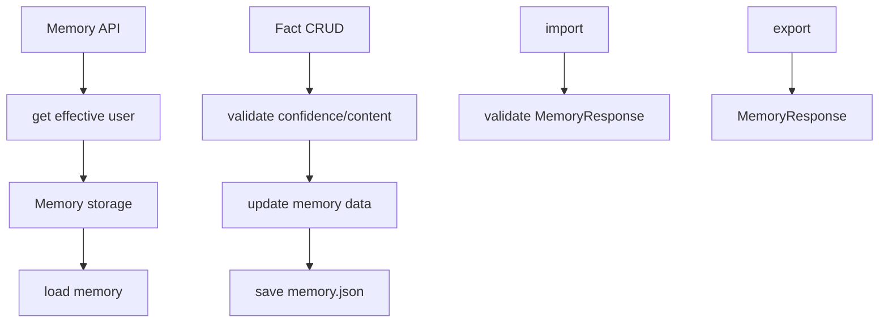
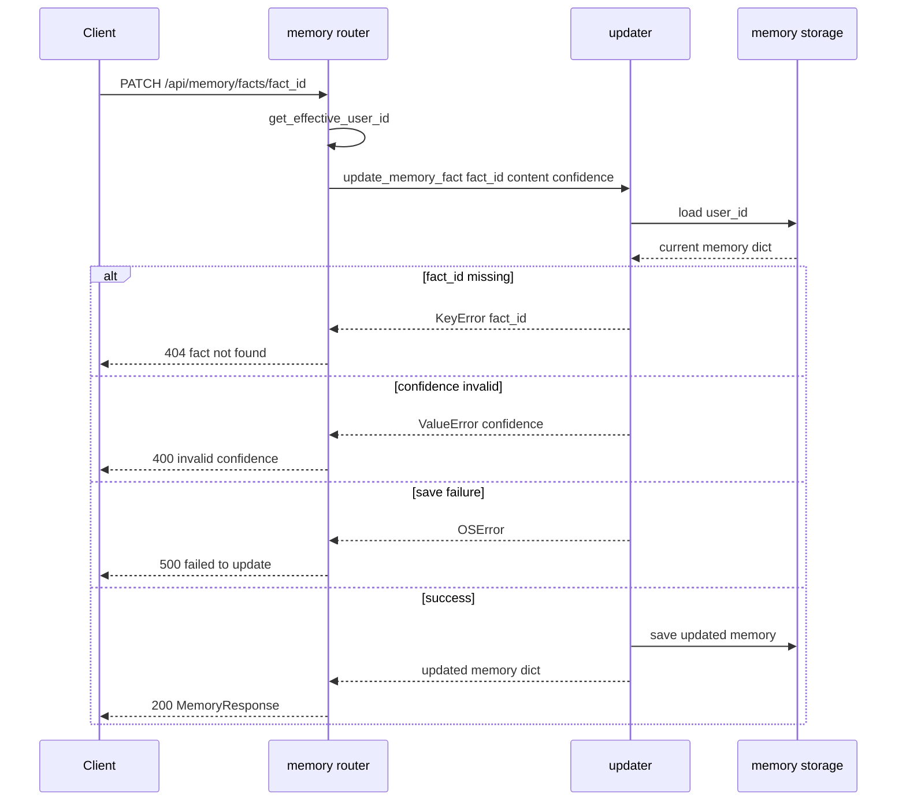

<title>56｜memory.py Router 单文件详解</title>

<callout emoji="✅">
**本章目标：**单独讲清 memory.py 的接口职责、数据流和修改风险。
</callout>

# 1. 接口职责

| 接口 | 职责 |
|-|-|
| `GET /api/memory` | 读取 memory。 |
| `POST reload` | 强制 reload。 |
| `DELETE` | 清空 memory。 |
| `facts CRUD` | 新增/更新/删除 fact。 |
| `import/export/status/config` | 导入导出和状态配置。 |

# 2. 运行逻辑图

# 3. 修改建议

- 先改 Pydantic request/response，再改 handler。
- 涉及用户数据必须确认 owner check 或 current user。
- 前端调用方要同步更新 core API/hook。

---

# 补充：设计取舍、重点代码与阅读路径

<callout emoji="💡">
**设计目的：**该文档用于把模块职责、运行逻辑、关键代码和阅读路径固定下来，帮助读者从源码验证行为。
</callout>

| 维度 | 说明 |
|-|-|
| 收益 | 读者可以按文档快速定位模块入口和上下游关系。 |
| 代价 | 文档需要随源码变更持续校准，避免模板化描述掩盖真实行为。 |
| 重点代码 | 标题对应的源码、测试或文档入口。 |
| 阅读路径 | 先看上游输入，再看核心函数，最后看下游输出和测试验证。 |

