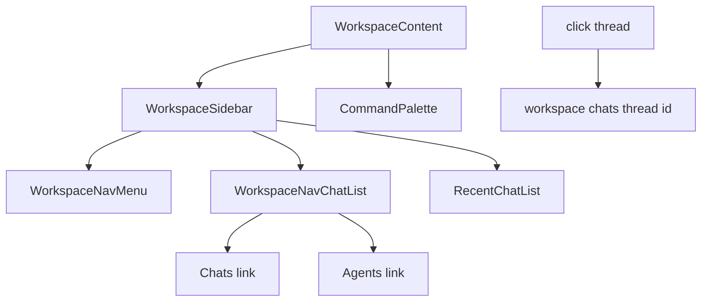
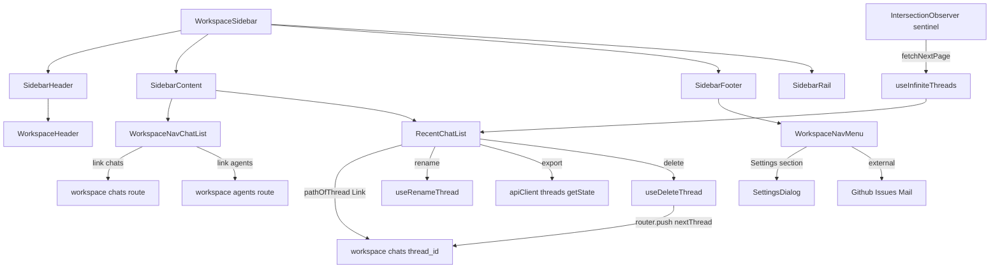

<title>60｜Frontend Sidebar 与 Navigation 组件详解</title>

<callout emoji="✅">
**本章目标：**单独讲清 Sidebar components 的接口职责、数据流和修改风险。
</callout>

# 1. 接口职责

| 组件 | 职责 |
|-|-|
| `workspace-sidebar.tsx` | workspace 侧边栏总装配。 |
| `workspace-nav-chat-list.tsx` | 会话导航列表。 |
| `recent-chat-list.tsx` | 最近会话列表。 |
| `workspace-nav-menu.tsx` | 主导航菜单。 |
| `command-palette.tsx` | 命令面板。 |

# 2. 运行逻辑图

# 3. 修改建议

- 改侧边栏布局时先确认 `WorkspaceSidebar` 的 Header / Content / Footer / Rail 分区。
- `WorkspaceNavChatList` 只负责 Chats / Agents 两个静态入口；会话历史和分页不要写到这个组件里。
- 最近会话列表相关逻辑应优先检查 `RecentChatList` 和 threads hooks，避免把导航入口和数据列表耦合。

## 补充：Sidebar 与 Navigation 简化运行图

---

# 补充：设计取舍、重点代码与阅读路径

<callout emoji="💡">
**设计目的：**Sidebar 与 Navigation 组件把 workspace 的固定入口、最近会话和底部菜单分层，避免静态导航与会话数据加载混在一起。
</callout>

| 维度 | 说明 |
|-|-|
| 收益 | 侧边栏结构稳定，静态入口和动态最近会话可独立维护。 |
| 代价 | 一次侧边栏体验可能跨 `WorkspaceSidebar`、`RecentChatList`、threads hooks 和 i18n 文案。 |
| 重点代码 | `frontend/src/components/workspace/workspace-sidebar.tsx`、`workspace-nav-chat-list.tsx`、`recent-chat-list.tsx`、`workspace-nav-menu.tsx`。 |
| 阅读路径 | 先看 `WorkspaceSidebar` 装配，再区分静态导航、最近会话列表和底部菜单。 |

