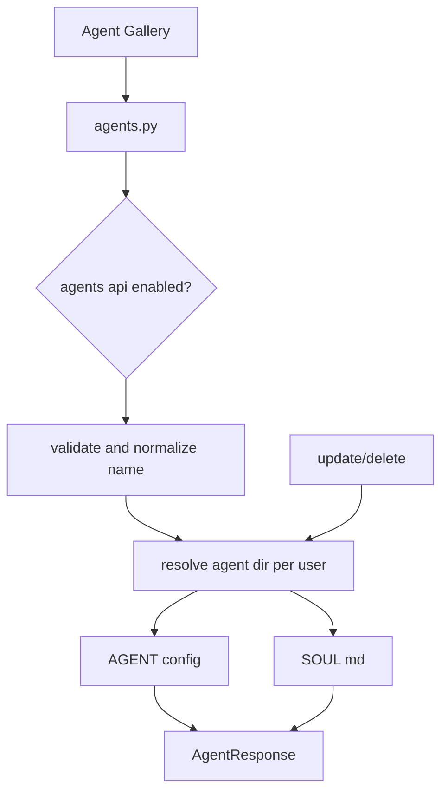
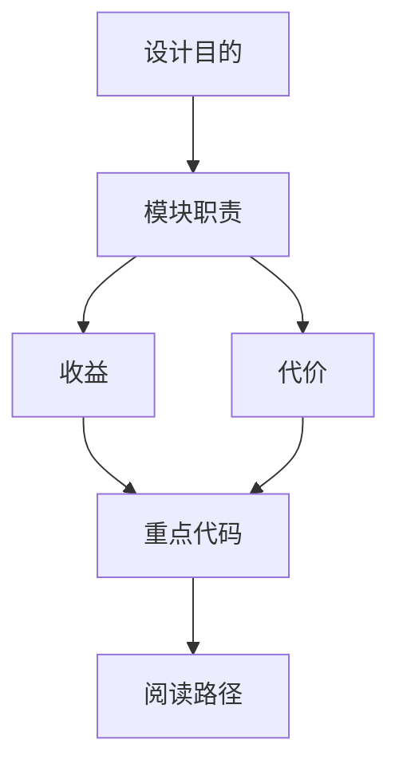

<title>62｜agents.py Router 单文件详解</title>

<callout emoji="✅">
**本章目标：**讲清 custom agents API、agent config/SOUL 读写和用户 profile。
</callout>

# 1. 模块职责

| 对象 | 说明 |
|-|-|
| `list_agents` | 列出自定义 agent。 |
| `check_agent_name` | 校验名称合法性和冲突。 |
| `create_agent_endpoint` | 创建 agent config 和 SOUL。 |
| `update_agent/delete_agent` | 更新/删除自定义 agent。 |
| `user_profile` | 读取和更新用户 profile。 |

# 2. 运行逻辑图

# 3. 排障与修改建议

- 先确认调用方和数据源，再改 schema。
- 涉及用户数据必须确认鉴权和 owner check。
- 涉及缓存需要同步 invalidate 或 reset。

---

# 补充：设计取舍、重点代码与阅读路径

<callout emoji="💡">
**设计目的：**该文档用于把模块职责、运行逻辑、关键代码和阅读路径固定下来，帮助读者从源码验证行为。
</callout>

| 维度 | 说明 |
|-|-|
| 收益 | 读者可以按文档快速定位模块入口和上下游关系。 |
| 代价 | 文档需要随源码变更持续校准，避免模板化描述掩盖真实行为。 |
| 重点代码 | 标题对应的源码、测试或文档入口。 |
| 阅读路径 | 先看上游输入，再看核心函数，最后看下游输出和测试验证。 |

