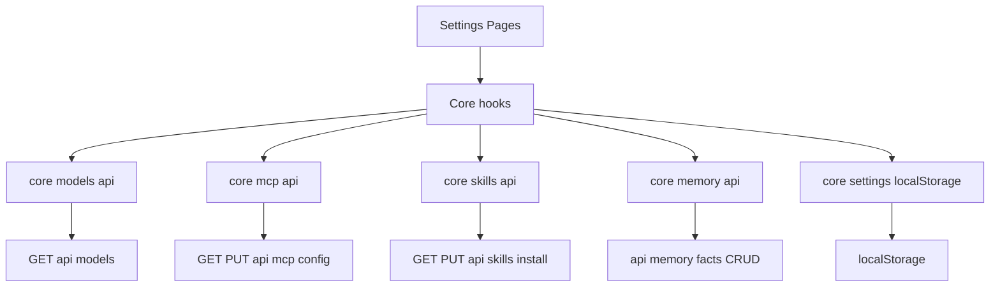
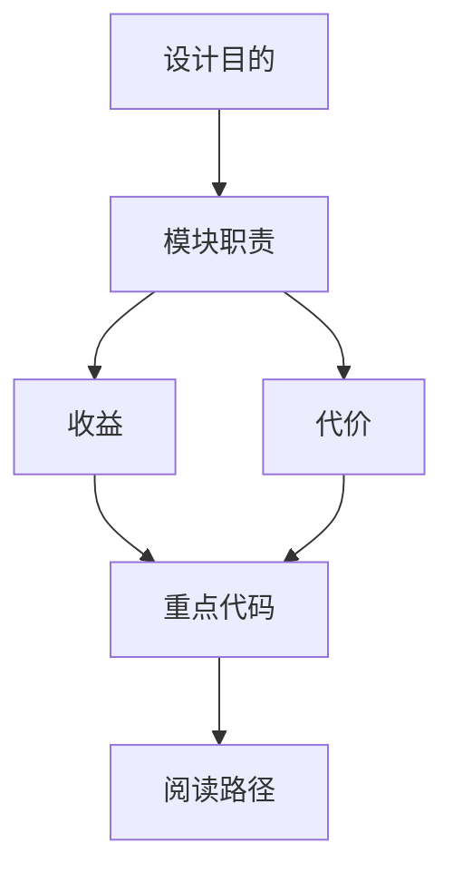

<title>65｜Frontend Core Settings/Models/MCP/Skills/Memory API 层详解</title>

<callout emoji="✅">
**本章目标：**讲清前端 core data layer 如何和后端 Settings API 对接。
</callout>

# 1. 模块职责

| 对象 | 说明 |
|-|-|
| `frontend/src/core/settings/*` | local settings、thread model override、hooks。 |
| `frontend/src/core/models/*` | loadModels 与 token usage enabled。 |
| `frontend/src/core/mcp/*` | load/update MCP config。 |
| `frontend/src/core/skills/*` | load/enable/install skills。 |
| `frontend/src/core/memory/*` | memory/facts CRUD、import/export。 |

# 2. 运行逻辑图

# 3. 排障与修改建议

- 先确认调用方和数据源，再改 schema。
- 涉及用户数据必须确认鉴权和 owner check。
- 涉及缓存需要同步 invalidate 或 reset。

---

# 补充：设计取舍、重点代码与阅读路径

<callout emoji="💡">
**设计目的：**该文档用于把模块职责、运行逻辑、关键代码和阅读路径固定下来，帮助读者从源码验证行为。
</callout>

| 维度 | 说明 |
|-|-|
| 收益 | 读者可以按文档快速定位模块入口和上下游关系。 |
| 代价 | 文档需要随源码变更持续校准，避免模板化描述掩盖真实行为。 |
| 重点代码 | 标题对应的源码、测试或文档入口。 |
| 阅读路径 | 先看上游输入，再看核心函数，最后看下游输出和测试验证。 |

